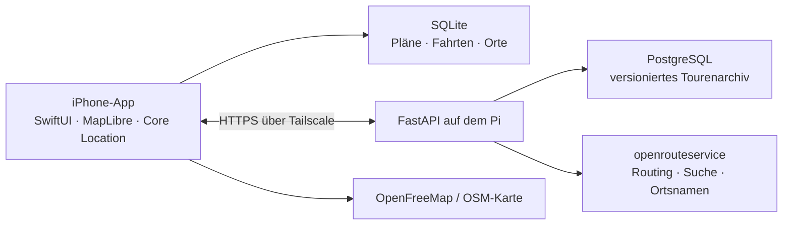

# Architektur

BikeNavi besteht aus einer nativen iPhone-App und einem privaten Backend auf einem Raspberry Pi. Das iPhone bleibt während einer Fahrt handlungsfähig: Es hält Planung, Route und Aufzeichnung lokal vor. Der Pi berechnet neue Routen, führt die Ortssuche aus und hält das zentrale Tourenarchiv.



## iPhone

`ios/BikeNavi/` enthält die SwiftUI-Oberfläche. `AppState` bündelt den Planungszustand, die lokale Speicherung, Standortupdates, Navigation und die Synchronisation. Views verändern keine Datenbank direkt.

`ios/BikeNavi/Core/` ist bewusst ohne UI aufgebaut und wird als Swift Package getestet:

| Baustein | Verantwortung |
| --- | --- |
| `Models.swift` | Planungen, Fahrten, Wegpunkte, Favoriten, Routen und Profile |
| `LocalStore.swift` | Dauerhafte SQLite-Speicherung auf dem iPhone |
| `APIClient.swift` | Authentifizierte HTTPS-Aufrufe an den Pi |
| `Navigation.swift` | Fortschritt auf der Route, GPS-Filter und Regel für Neuberechnung |
| `GPX.swift` | Export abgeschlossener Fahrten |

MapLibre zeichnet die Karten, Wegpunkte, Aufzeichnung und Routenabschnitte. Belagsinformationen sind an Geometrie-Indizes gebunden. Fehlen diese Indizes bei einer älteren Route, bleibt ihre Linie grau statt Beläge zu erraten.

Die Fahrtansicht folgt der Fahrtrichtung bei einer Zoomstufe für ungefähr 300 m Vorausschau. Eine Abweichung löst nur bei mindestens 80 m Abstand über zehn Sekunden eine neue Anfrage aus. Danach schützt eine Wartezeit von 90 Sekunden vor wiederholten Anfragen. Die neue Route beginnt am aktuellen Standort und enthält verbleibende Zwischenziele sowie das Ziel.

## Pi-Backend

`server/bikenavi/` ist eine FastAPI-Anwendung. Sie läuft zusammen mit PostgreSQL in einem eigenen Docker-Compose-Projekt. Der HTTP-Port ist nur über Loopback erreichbar; Tailscale Serve stellt den privaten HTTPS-Zugang bereit.

| Endpunkt | Zweck |
| --- | --- |
| `GET /health` | Gesundheitsprüfung ohne Zugangsdaten |
| `GET /v1/status` | Routing- und Serverstatus |
| `POST /v1/route` | Routenberechnung mit Profil, Höhen- und Belagsdaten |
| `GET /v1/search` | Orts-, Adress- und POI-Suche |
| `GET /v1/place-name` | Name für einen Kartenpunkt |
| `POST /v1/mutations` | Versioniertes Speichern einer Planung oder Fahrt |
| `GET /v1/changes` | Abgleich seit einer Serverrevision |

Jede Änderung hat eine Mutation-ID und eine Basisrevision. Wiederholte Übertragungen erzeugen keine Dublette. Treffen widersprüchliche Änderungen aufeinander, bewahrt die App die lokale Fassung als Kopie, statt still zu überschreiben.

## Daten und Sicherheit

Die App speichert den API-Zugang im iOS-Schlüsselbund. Der ORS-Schlüssel bleibt ausschließlich in der `.env` des Servers. `.env`, Datenbanken, Testausgaben, Backups und Build-Ergebnisse gehören nicht in Git.

Die Grundkarte basiert auf OpenStreetMap-Daten und wird zunächst über OpenFreeMap geladen. Vollständige Offline-Kartenpakete und ein eigener Kartenserver sind noch nicht produktiv eingerichtet. Bereits gespeicherte Routen, Abbiegehinweise und GPS-Aufzeichnung funktionieren ohne erneute Routenberechnung weiter.

## Betrieb und Prüfungen

Lokale Tests:

```sh
.venv/bin/python -m pytest server/tests -q
swift test --scratch-path build/SwiftTests
```

Für den Pi stehen `scripts/deploy_pi.py`, `scripts/check_pi.py` und `scripts/backup_pi.py` bereit. Die genaue Einrichtung, Umgebungsvariablen und Sicherheitsgrenzen stehen in der [README](../README.md).
