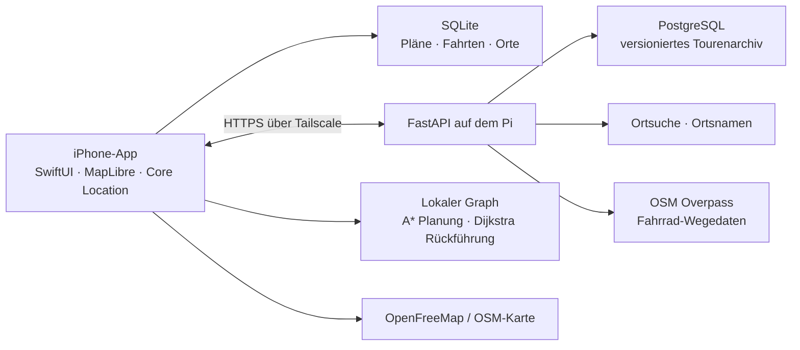

# Architektur

BikeNavi besteht aus einer nativen iPhone-App und einem privaten Backend auf einem Raspberry Pi. Das iPhone bleibt während einer Fahrt handlungsfähig: Es hält Planung, Route und Aufzeichnung lokal vor. Das iPhone berechnet Planung und Rückführung selbst. Der Pi liefert Wegedaten, führt die Ortssuche aus und hält das zentrale Tourenarchiv.



## iPhone

`ios/BikeNavi/` enthält die SwiftUI-Oberfläche. `AppState` bündelt den Planungszustand, die lokale Speicherung, Standortupdates, Navigation und die Synchronisation. Views verändern keine Datenbank direkt.

`ios/BikeNavi/Core/` ist bewusst ohne UI aufgebaut und wird als Swift Package getestet:

| Baustein | Verantwortung |
| --- | --- |
| `Models.swift` | Planungen, Fahrten, Wegpunkte, Favoriten, Routen und Profile |
| `LocalStore.swift` | Dauerhafte SQLite-Speicherung auf dem iPhone |
| `APIClient.swift` | Authentifizierte HTTPS-Aufrufe an den Pi |
| `Navigation.swift` | Routenprojektion/Magnet, Fortschritt, GPS-Filter und Regel für Neuberechnung |
| `LocalRouter.swift` | Lokale Planung und Anschluss plus verbleibende Route |
| `OfflineRoutingStore.swift` | Versionierte Wegedaten, Download, Graph-Wiederverwendung |
| `GPX.swift` | Export abgeschlossener Fahrten |

MapLibre zeichnet die Karten, Wegpunkte, Aufzeichnung und Routenabschnitte. Belagsinformationen sind an Geometrie-Indizes gebunden. Fehlen diese Indizes bei einer älteren Route, bleibt ihre Linie grau statt Beläge zu erraten. Neue lokale Planungen gewinnen Kreuzungsarme aus dem gespeicherten OSM-Graphen. Die App speichert diese Kreuzungsgeometrie in der Route und zeichnet sie ohne Karten- oder Netzwerkzugriff in der Live-Aktivität.

Die Fahrtansicht hält den Standort bei 80 % der Kartenhöhe und kalibriert den Maßstab auf 500 m bis zum oberen Rand. Die Kamera fordert die maximale Neigung von 60° an; MapLibre begrenzt sie zusätzlich für den versetzten Mittelpunkt. Bei Bewegung verwendet die Karte den aktuellen GPS-Kurs, im Stand oder bei langsamer Fahrt den Kompass. Manuelle Kartenänderungen pausieren die Nachführung für zehn Sekunden; die Rückkehr benötigt keinen neuen GPS-Punkt. Bis 25 m Abstand rastet die Anzeige bei passender Genauigkeit und Richtung auf der Route ein. Eine bestätigte Abweichung ab 35 m über fünf Sekunden und mindestens drei genaue Messungen startet die lokale Anschlussberechnung. Sie minimiert Anschluss plus verbleibenden Originalweg, wahrt offene Zwischenziele und hat ein Suchbudget von zwei Sekunden. Nach zehn Sekunden darf erneut gerechnet werden. Details und Grenzen: [LOKALE_NEUBERECHNUNG.md](LOKALE_NEUBERECHNUNG.md).

## Pi-Backend

`server/bikenavi/` ist eine FastAPI-Anwendung. Sie läuft zusammen mit PostgreSQL in einem eigenen Docker-Compose-Projekt. Der HTTP-Port ist nur über Loopback erreichbar; Tailscale Serve stellt den privaten HTTPS-Zugang bereit.

| Endpunkt | Zweck |
| --- | --- |
| `GET /health` | Gesundheitsprüfung ohne Zugangsdaten |
| `GET /v1/status` | Routing- und Serverstatus |
| `POST /v1/route` | Legacy-Routing für ältere Apps; von der aktuellen App nicht mehr verwendet |
| `GET /v1/offline-tiles/{x}/{y}` | Gespeicherte OSM-Fahrradgraphen für die lokale Suche |
| `GET /v1/search` | Orts-, Adress- und POI-Suche |
| `GET /v1/place-name` | Name für einen Kartenpunkt |
| `POST /v1/mutations` | Versioniertes Speichern einer Planung oder Fahrt |
| `GET /v1/changes` | Abgleich seit einer Serverrevision |

Jede Änderung hat eine Mutation-ID und eine Basisrevision. Wiederholte Übertragungen erzeugen keine Dublette. Treffen widersprüchliche Änderungen aufeinander, bewahrt die App die lokale Fassung als Kopie, statt still zu überschreiben.

## Daten und Sicherheit

Die App speichert den API-Zugang im iOS-Schlüsselbund. Der ORS-Schlüssel bleibt ausschließlich in der `.env` des Servers. `.env`, Datenbanken, Testausgaben, Backups und Build-Ergebnisse gehören nicht in Git.

Die Grundkarte basiert auf OpenStreetMap-Daten und wird zunächst über OpenFreeMap geladen. Vollständige Offline-Kartenpakete und ein eigener Kartenserver sind noch nicht produktiv eingerichtet. Bereits gespeicherte Routen, Abbiegehinweise und GPS-Aufzeichnung funktionieren ohne erneute Routenberechnung weiter.

## Betrieb und Prüfungen

Lokale Tests:

```sh
.venv/bin/python -m pytest server/tests -q
swift test --scratch-path build/SwiftTests
```

Für den Pi stehen `scripts/deploy_pi.py`, `scripts/check_pi.py` und `scripts/backup_pi.py` bereit. Die genaue Einrichtung, Umgebungsvariablen und Sicherheitsgrenzen stehen in der [README](../README.md).

### Revision der Zugangsauswertung

Offline-Kacheln behalten Schema-Version 1 und enthalten zusätzlich `compilerRevision: 2`. Der Pi trennt Cacheeinträge nach Schema, Compilerrevision und Gebiet (`1/2/x/y`), damit bis zu 30 Tage alte Ergebnisse der fehlerhaften Schrankenauswertung nicht weiter ausgeliefert werden. Ältere Clients können das zusätzliche Feld ignorieren. Neue Clients lesen fehlende Revisionen als Altbestand und erneuern sie beim Vorbereiten mit API-Client; diese Prüfung umfasst Routenmanifeste, Gebietreferenzen und den vorbereiteten Graphen. Ohne API-Client sowie beim direkten Laden gespeicherter Touren bleiben Altbestände lesbar. Unveränderliche Dateien und atomare Manifeste erhalten bestehende Offline-Pakete bei fehlgeschlagenen Downloads. App und Pi müssen für die automatische Migration aktualisiert werden.
