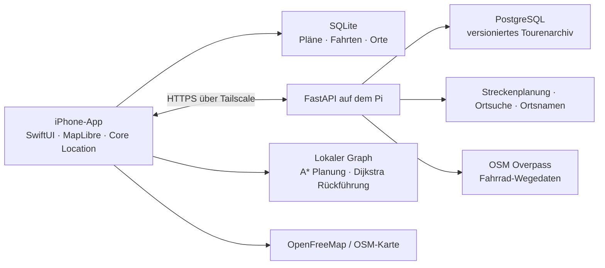

# Architektur

## Tourtagebuch und Blog

`BlogPoint` speichert einen aktuellen Ort, Zeit, Titel, Notiz und optional ein auf dem iPhone neu encodiertes JPEG. `LocalStore` hält Punkte und HTML-Entwürfe getrennt pro Fahrt; beim Löschen einer Fahrt werden diese Daten lokal entfernt. Nach dem Fahrtdokument synchronisiert `AppState` nur idempotente Punkte mit dem Pi und ruft sie seitenweise wieder ab. Der Pi akzeptiert Punkte ausschließlich zu vorhandenen Fahrten und begrenzt sie auf 50 Punkte, 768 KB je Bild und 20 MB insgesamt.

`BlogGenerator` erzeugt für eine beendete, vollständig synchronisierte Fahrt eine portable HTML-Fassung mit eigener SVG-Streckenkarte, Höhenprofil, Bildern sowie begrenzter Wikipedia- und OpenTopoMap-Recherche. Ohne beide optionalen Umgebungsvariablen `BLOG_OPENAI_API_KEY` und `BLOG_OPENAI_MODEL` bleibt es bei einem lokalen Vorlagenentwurf. Mit ihnen recherchiert ein eigener Websuchschritt anhand ausgewählter Ortsnamen/Koordinaten und formuliert danach einen strukturierten Blogtext aus Notizen, geplanten Höhenwerten und belegten Quellen; Fotos und vollständige GPS-Spuren verlassen den Pi nicht. HTML-Vorschauen deaktivieren JavaScript. Additive Tabellen, Datenübertragung, Konflikte, konsistente Erstellung und Betriebsgrenzen: [BLOG.md](BLOG.md).

BikeNavi besteht aus einer nativen iPhone-App und einem privaten Backend auf einem Raspberry Pi. Das iPhone bleibt während einer Fahrt handlungsfähig: Es hält Planung, Route und Aufzeichnung lokal vor. Mit eingerichtetem Pi berechnet openrouteservice die Strecke; das iPhone berechnet lokale Rückführungen in einem mitwandernden 3-km-Umkreis selbst. Ohne API-Client bleibt lokale Planung aus gespeicherten Gebietsdaten möglich. Der Pi liefert Wegedaten, führt die Ortssuche aus und hält das zentrale Tourenarchiv.


```mermaid
flowchart LR
    PHONE[iPhone-App\nSwiftUI · MapLibre · Core Location] --> LOCAL[SQLite\nPläne · Fahrten · Orte]
    PHONE <-->|HTTPS über Tailscale| API[FastAPI auf dem Pi]
    API --> ARCHIVE[PostgreSQL\nversioniertes Tourenarchiv]
    API --> ORS[Streckenplanung · Ortsuche · Ortsnamen]
    PHONE --> ROUTER[Lokaler Graph\nA* Planung · Dijkstra Rückführung]
    API --> OSM[OSM Overpass\nFahrrad-Wegedaten]
    PHONE --> MAP[OpenFreeMap / OSM-Karte]
```

## iPhone

`ios/BikeNavi/` enthält die SwiftUI-Oberfläche. `AppState` bündelt den Planungszustand, die lokale Speicherung, Standortupdates, Navigation und die Synchronisation. Views verändern keine Datenbank direkt.

Der Fahrtstart gleicht den Standortzugriff mit der aktuellen Core-Location-Berechtigung ab. Ein Fehlercallback allein setzt keine dauerhafte Zugriffssperre. Der Start verwendet eine höchstens 15 Sekunden alte Position mit maximal 100 m gemeldeter Ungenauigkeit und wartet sonst bis zu 15 Sekunden auf einen geeigneten Fix. Mehrfachtippen erzeugt keinen zweiten Start. Abbruch, Tabwechsel, Verlassen des aktiven App-Zustands und Änderungen der Planungs-/Routen-ID verwerfen den ausstehenden Start; verspätete Messungen starten dann keine Fahrt. Bei Rückkehr in den Vordergrund wird der Standortdienst erneut angefordert. Zeitlimit und tatsächlich verweigerte Berechtigung haben getrennte Meldungen. Die Wartezeit wird mit einer monotonen Uhr gemessen.

Die Einstellungen betten Apples `MPVolumeView` über `UIViewRepresentable` ein und verändern damit direkt die System-Medienlautstärke. `AppState` beobachtet `AVAudioSession.outputVolume` während der sichtbaren Einstellungen per KVO; Änderungen ersetzen nach 180 ms die Kinderreim-Hörprobe. Navigation und Hörprobe verwenden `AVSpeechUtterance.volume = 1`, ohne zusätzlichen Lautstärkefaktor. Der frühere lokale Schlüssel `speechVolume` wird entfernt. Beim Verlassen der Ansicht bzw. Hintergrundwechsel werden Beobachtung und Probe beendet; Navigation beendet eine laufende Probe. Der Simulator zeigt ausdrücklich einen Verfügbarkeitshinweis statt eines funktionslosen Ersatzreglers. Systemlautstärke und Hardwaretasten sind am Gerät zu prüfen. Referenz: [Apples MPVolumeView-Dokumentation](https://developer.apple.com/documentation/mediaplayer/mpvolumeview).

`ios/BikeNavi/Core/` ist bewusst ohne UI aufgebaut und wird als Swift Package getestet:

| Baustein | Verantwortung |
| --- | --- |
| `Models.swift` | Planungen, Fahrten, Wegpunkte, Favoriten, Routen und Profile |
| `LocalStore.swift` | Dauerhafte SQLite-Speicherung auf dem iPhone |
| `APIClient.swift` | Authentifizierte HTTPS-Aufrufe an den Pi |
| `Navigation.swift` | Routenprojektion/Magnet, Fortschritt, GPS-Filter und Regel für Neuberechnung |
| `LocalRouter.swift` | Lokale Planung und Anschluss plus verbleibende Route |
| `OfflineRoutingStore.swift` | Versionierte Wegedaten, Download, Graph-Wiederverwendung |
| `GPX.swift` | Export abgeschlossener Fahrten |

MapLibre zeichnet die Karten, Wegpunkte, Aufzeichnung und Routenabschnitte. Belagsinformationen sind an Geometrie-Indizes gebunden. Fehlen diese Indizes bei einer älteren Route, bleibt ihre Linie grau statt Beläge zu erraten. Neue lokale Planungen gewinnen Kreuzungsarme aus dem gespeicherten OSM-Graphen. Die App speichert diese Kreuzungsgeometrie in der Route und zeichnet sie ohne Karten- oder Netzwerkzugriff in der Live-Aktivität.

Die Fahrtansicht hält den Standort bei 80 % der Kartenhöhe und kalibriert den Maßstab auf 500 m bis zum oberen Rand. Die Kamera fordert die maximale Neigung von 60° an; MapLibre begrenzt sie zusätzlich für den versetzten Mittelpunkt. Bei Bewegung verwendet die Karte den aktuellen GPS-Kurs, im Stand oder bei langsamer Fahrt den Kompass. Manuelle Kartenänderungen pausieren die Nachführung für zehn Sekunden; die Rückkehr benötigt keinen neuen GPS-Punkt. Bis 25 m Abstand rastet die Anzeige bei passender Genauigkeit und Richtung auf der Route ein. Eine bestätigte Abweichung ab 35 m über fünf Sekunden und mindestens drei genaue Messungen startet die lokale Anschlussberechnung. Sie minimiert Anschluss plus verbleibenden Originalweg, wahrt offene Zwischenziele und hat ein Suchbudget von zwei Sekunden. Nach zehn Sekunden darf erneut gerechnet werden. Details und Grenzen: [LOKALE_NEUBERECHNUNG.md](LOKALE_NEUBERECHNUNG.md).

## Pi-Backend

`server/bikenavi/` ist eine FastAPI-Anwendung. Sie läuft zusammen mit PostgreSQL in einem eigenen Docker-Compose-Projekt. Der HTTP-Port ist nur über Loopback erreichbar; Tailscale Serve stellt den privaten HTTPS-Zugang bereit.

| Endpunkt | Zweck |
| --- | --- |
| `GET /health` | Gesundheitsprüfung ohne Zugangsdaten |
| `GET /v1/status` | Routing- und Serverstatus |
| `POST /v1/route` | Streckenplanung über ORS; aktuelle App mit `include_context=false` |
| `GET /v1/offline-tiles/{x}/{y}` | Gespeicherte OSM-Fahrradgraphen für die lokale Suche |
| `GET /v1/search` | Orts-, Adress- und POI-Suche |
| `GET /v1/place-name` | Name für einen Kartenpunkt |
| `POST /v1/mutations` | Versioniertes Speichern einer Planung oder Fahrt |
| `GET /v1/changes` | Abgleich seit einer Serverrevision |

Jede Änderung hat eine Mutation-ID und eine Basisrevision. Wiederholte Übertragungen erzeugen keine Dublette. Treffen widersprüchliche Änderungen aufeinander, bewahrt die App die lokale Fassung als Kopie, statt still zu überschreiben.

## Daten und Sicherheit

Die App speichert den API-Zugang im iOS-Schlüsselbund. Der ORS-Schlüssel bleibt ausschließlich in der `.env` des Servers. `.env`, Datenbanken, Testausgaben, Backups und Build-Ergebnisse gehören nicht in Git.

`MapStyle` definiert die Kartenansichten Standard (Liberty DE), Hell (Positron), Detailreich (Bright), Dunkel, Satellit (Esri World Imagery), Topografisch (OpenTopoMap) und eigener Kartenstil. `AppState.selectedMapStyle` bleibt ausschließlich im Arbeitsspeicher und beginnt bei jeder Initialisierung mit Standard. Die separat gespeicherte eigene Stiladresse bleibt erhalten; die aktive Auswahl wird nicht persistiert und bei Rückkehr aus dem Hintergrund nicht zurückgesetzt. Alle `RouteMap`-Ansichten verwenden dieselbe abgeleitete Stiladresse. Die beiden Rasterstile liegen als JSON-Ressourcen im App-Bundle, eingebunden durch den Projektgenerator; Quellenattribution und maximale Quellzoomstufen (19/17) sind darin enthalten. Beim Stilwechsel werden Annotationen nach dem Laden neu gezeichnet; nur der erste Stil lädt die anfängliche Routenübersicht, spätere Wechsel erhalten den Kartenausschnitt. Navigation behält ihre Kamera-Nachführung. Öffentliche Ansichten sind vom Offline-Paketdownload ausgeschlossen, selbst wenn dessen Schalter aktiv ist. Nur ein gewählter eigener HTTPS-Kartenstil kann freigegeben werden.

Die Standard-Grundkarte basiert auf OpenStreetMap-Daten und wird über OpenFreeMap geladen. Vollständige Offline-Kartenpakete und ein eigener Kartenserver sind noch nicht produktiv eingerichtet. Bereits gespeicherte Routen, Abbiegehinweise und GPS-Aufzeichnung funktionieren ohne erneute Routenberechnung weiter.

## Betrieb und Prüfungen

Lokale Tests:

```sh
.venv/bin/python -m pytest server/tests -q
swift test --scratch-path build/SwiftTests
```

Für den Pi stehen `scripts/deploy_pi.py`, `scripts/check_pi.py` und `scripts/backup_pi.py` bereit. Die genaue Einrichtung, Umgebungsvariablen und Sicherheitsgrenzen stehen in der [README](../README.md).

### Revision der Wegenetzaufbereitung

Offline-Kacheln behalten Schema-Version 1 und enthalten zusätzlich `compilerRevision: 3`. Der Pi trennt Cacheeinträge nach Schema, Compilerrevision und Gebiet (`1/3/x/y`), damit alte Ergebnisse ohne OSM-Knotenversionen nicht weiter ausgeliefert werden (Revision 2 korrigierte zuvor die Schrankenauswertung). Ältere Clients können das zusätzliche Feld ignorieren. Neue Clients lesen fehlende Revisionen als Altbestand und erneuern sie beim Vorbereiten mit API-Client; diese Prüfung umfasst Routenmanifeste, Gebietreferenzen und den vorbereiteten Graphen. Ohne API-Client sowie beim direkten Laden gespeicherter Touren bleiben Altbestände lesbar. Unveränderliche Dateien und atomare Manifeste erhalten bestehende Offline-Pakete bei fehlgeschlagenen Downloads. App und Pi müssen für die automatische Migration aktualisiert werden.

Die Overpass-Abfrage verwendet `out meta`; nur die positive OSM-Knotenversion wird als optionales `osmVersion` übernommen, keine Bearbeiternamen oder Benutzerkennungen. Bei widersprüchlichen Positionen desselben Knotens gewinnt die höhere OSM-Version, unabhängig vom Downloadzeitpunkt. Zugangsausschlüsse bleiben konservativ. Ohne eindeutige Version wird einmal das gesamte benötigte Gebiet mit `refresh=true` erneuert; bleibt der Konflikt bestehen, erscheint eine eigene Kartenstand-Fehlermeldung. Das bestehende Routenmanifest wird erst nach erfolgreichem Graphaufbau ersetzt.

### Höhenanreicherung nach lokaler Planung

`Core/RouteElevation.swift` tastet die unveränderte Route entlang ihrer kumulierten Weglänge mit etwa 30 m Abstand ab (maximal 2.000 Punkte), glättet validierte Höhen und berechnet Anstieg/Abstieg. `AppState` lädt fehlende Profile als separate, abbrechbare Hintergrundaufgabe nach Berechnung und beim Öffnen. Plan- und Routen-ID sowie Anfrage-ID verhindern, dass verspätete Antworten andere Planungen überschreiben. Ein Fehler blockiert weder Planung noch Navigation; vorhandene Profile benötigen keinen erneuten Download.

Der authentifizierte Endpunkt `POST /v1/elevation` nimmt 2–2.000 Koordinaten entgegen. `server/bikenavi/elevation.py` ruft ausschließlich den festen ORS-Elevation-Endpunkt auf und prüft Anzahl, Reihenfolge, Position und endliche Höhen (-500 bis 9.000 m). ORS kann einzelne Höhenpunkte auslassen. Die Antwort wird anhand ihrer Koordinaten als geordnete Teilfolge zugeordnet. Nur innere Lücken mit höchstens zwei fehlenden Punkten, maximal 100 m zwischen den umschließenden gültigen Werten und insgesamt höchstens acht fehlenden Punkten werden entlang der Distanz linear interpoliert. Die Quelle nennt die Anzahl ergänzter Punkte. Fehlende Randwerte, größere Lücken, verschobene oder ungültige Antworten sowie Dienstfehler werden als 503 ohne Weitergabe von Schlüssel oder Upstream-Fehlerdetails behandelt. Die App übernimmt nur vollständige Antworten. Der ORS-Schlüssel bleibt auf dem Pi.

`CalculatedRoute`/`Route` erhalten die optionalen Felder `elevationProfile` (Distanz-/Höhenpaare) und `elevationSource`. Alte Touren bleiben lesbar. SQLite-Speicherung und PostgreSQL-Synchronisation übernehmen beide Felder; Datenbankmigrationen sind nicht erforderlich. Die Originalkoordinaten erhalten interpolierte Höhen für GPX, ihre Zahl und alle Indexbezüge bleiben erhalten. Die Anzeige erkennt verfügbare Höhen anhand der Daten statt anhand des Provider-Namens. Beim Kombinieren oder Kürzen lokaler Rückführungen werden nicht mehr gültige Profile und Summen verworfen.

Dienstreferenzen: [API und SRTM-Datenquelle](https://github.com/GIScience/openelevationservice), [ORS-Abfragelimit](https://openrouteservice.org/restrictions/).

### Zwischenziele während einer Abweichung

`LocalNavigationState.skippedWaypointOrdinals` speichert optional die ausdrücklich ausgelassenen Zwischenziele anhand ihrer Position in der Wegpunktliste. Fehlende Werte in älteren Fahrten bedeuten keine ausgelassenen Ziele. Originalgeometrie, Planung und aufgezeichnete GPS-Punkte werden dadurch nicht geändert. Das Backend erhält das optionale Feld ebenfalls, damit die Synchronisation die Entscheidung bewahrt; Start und Fahrtziel sind dort als übersprungene Ziele unzulässig. `LocalRouteMetrics` verwendet diese Liste sowohl bei der lokalen Anschlusssuche als auch bei der Rückkehr zur Originalroute; das letzte Ziel bleibt verpflichtend.

Nach der bestehenden GPS-Abweichungsbestätigung bietet `AppState` das nächste offene Zwischenziel an. Eine globale, richtungsabhängige Projektion auf die Originalroute kann mehrere bereits hinter der Position liegende Ziele gemeinsam anbieten. Die Zustimmung wird vor der Neuberechnung gespeichert; ein alter Anschluss wird verworfen. Bei Abweichung beziehungsweise direkt nach der Zustimmung darf eine globale Projektion den begrenzten Tracker-Suchbereich verlassen, jedoch nicht über das nächste weiterhin verpflichtende Ziel hinaus. Im normalen Fahrbetrieb bleibt das lokale Tracker-Fenster erhalten. Ablehnungen werden für die laufende App-Sitzung unterdrückt. Der Dialog verändert keine Ziele ohne Tastendruck.

## Lange Strecken und mitwanderndes Umfeld (24.09.2026)

`OfflineRoutingStore.calculate` nutzt bei eingerichtetem API-Client `/v1/route?include_context=false`. Diese Option überspringt die bisherige optionale Overpass-Anreicherung der gesamten Strecke; der Standardwert bleibt für ältere Clients `true`. Routenberechnung und Speicherung sind unabhängig von `prepareNeighborhood`. Fehlende lokale Daten können daher keine erfolgreich berechnete Serverroute mehr verwerfen. Routingprofil und Zwischenziele werden unverändert an den bestehenden Anbieterpfad übergeben; dessen Belagsprüfungen bleiben aktiv.

ORS-Routenaufrufe erhalten 75 Sekunden Lesezeit und 10 Sekunden Verbindungszeit. Bis zu zwei Profilkandidaten werden parallel angefragt und anschließend nach den bisherigen Belagsregeln ausgewertet. Eine gemeinsame Grenze von 80 Sekunden bricht ausstehende Anbieteranfragen ab; die App wartet 90 Sekunden. Diese Grenze gilt für die Anbieterphase, nicht für die optionale Kreuzungsanreicherung älterer Clients. Ortssuche und sonstige Dienste behalten ihre bisherigen Zeitlimits. Hintergrund: Eine öffentliche Beispielroute Rodgau–Göteborg benötigte bei der Prüfung am 25.09.2026 direkt bei ORS 60,5 Sekunden; der bisherige Pi-Aufruf brach bereits nach 35,1 Sekunden ab.

`OfflineTileID.neighborhood` wählt die Kacheln im 3,5-km-Fenster um die GPS-Position (3 km Suchradius plus 500 m Vorlauf). `AppState` prüft die Abdeckung bei genauen, frischen GPS-Messungen und lädt fehlende Bereiche mit höchstens einem laufenden Fahrt-Task und mindestens 30 Sekunden zwischen Versuchen. Fahrt-ID, Request-ID und Aufzeichnungszustand sichern die Ergebnisübernahme. Pause und Ende brechen den Download ab. Ein vollständiges neues Fenster ersetzt Graph und Routenmanifest atomar; Fehler erhalten das vorherige Paket. Die Manifeststruktur bleibt kompatibel, ihre Semantik ist jetzt ausdrücklich eine lokale Teilabdeckung. Alte Pakete bleiben lesbar.

Der Cache bleibt auf 250 MB begrenzt. Vor einem Download werden nötigenfalls alte, nicht mehr referenzierte Dateien entfernt; Manifeste und aktive Downloads schützen ihre Dateien. Die Suchgrenze von 3 km wird weiterhin im lokalen Router durchgesetzt, auch wenn vollständige OSM-Wege über eine Kachel hinausreichen. Ohne Netz kann das Fenster nur aus gespeicherten Kacheln erweitert werden. Alte Belagsdaten werden nur dann aus dem Graphen repariert, wenn alle Routenpunkte in dessen Kacheln liegen.

### Lokale Koordinaten- und Plus-Code-Suche

`SearchView` prüft vor dem API-Aufruf `PlusCode` und `CoordinateParser` im Swift-Core. WGS84-Dezimalgrad, Grad/Minuten und Grad/Minuten/Sekunden werden normalisiert, vollständig geparst und auf gültige Winkelbereiche geprüft. Kandidaten werden dedupliziert; einfache Dezimalgradpaare haben Vorrang vor unmarkierten Untereinheiten. Verbleibende Mehrdeutigkeit und widersprüchliche Vorzeichen/Himmelsrichtungen erzeugen einen Hinweis. Zahlen ohne Trennzeichen bleiben für die normale Postleitzahlensuche verfügbar. Alte Treffer werden vor jeder Suche gelöscht; parallele Suchstarts sind gesperrt.

`PlusCode` decodiert vollständige Open Location Codes lokal einschließlich Padding und Präzisionsraster. Verkürzte Codes werden nach dem Open-Location-Code-Verfahren relativ zu jedem über `APIClient.search` gefundenen Bezugsort ergänzt. Gesucht wird nur der Ortsname, ohne GPS-Nähefilter. Der Nutzer wählt den resultierenden Treffer. Die Geometrie ist jeweils die Zellmitte. Grundlage: [Open Location Code Specification](https://github.com/google/open-location-code/blob/main/Documentation/Specification/specification.md). Keine neuen Backend-Endpunkte oder Datenformate.

## Rad-/Wanderplanung (5. Oktober 2026)

`RidingProfile.travelMode` / API `Profile.travelMode`: optional `cycling`, `bikeAndHike`, `hiking`; fehlend bedeutet Rad. Swift lässt die Standardauswahl beim Kodieren weg. Neue Serverfelder werden bei `None` aus dem Mutation-Hash entfernt, damit alte Synchronisationsquittungen gültig bleiben.

`server/bikenavi/hiking.py` kapselt ORS `foot-walking` mit `traildifficulty`: vollständige, aufeinanderfolgende Geometriebereiche erforderlich, nur Werte 0 (kein Tag) und 1 (T1) erlaubt. Fahrrad-Belagspolitik und Steigungsgewichtung gelten ausschließlich im Radanteil. Fußziele werden höchstens 20 m versetzt; am Übergang beträgt die Join-Toleranz 1 m. Ohne Verbindung wird keine Luftlinienkante erzeugt.

Kombinationssuche: zunächst vollständige Radroute mit lückenloser ORS-Wegartenprüfung (allgemeiner Pfad 4, Fußweg 7 und Treppe 8 erfordern Wanderanteil; Radweg 6 bleibt erlaubt) und Prüfung aller tatsächlichen Wegpunktpositionen (20 m Toleranz); sonst einfache Wanderroute vom letzten Zwischenziel/Start zum Ziel. Bei mehr als 10 km Luftlinie vom letzten Rad-Wegpunkt startet die Wanderannäherung an einem per ORS-Snap gefundenen Radpunkt im 5-km-Zielumfeld, damit lange Rad-Anfahrten kein Wander-Distanzlimit überschreiten. Bis zu 100 Suchpunkte entlang der letzten 10 km, ORS `/v2/snap/{cycling-profile}/json` mit 100 m Radius, Deduplizierung auf 10 m, höchstens acht Kandidaten. Suchpunkte auf Fußwegen/Pfaden/Treppen verbrauchen keinen Kandidatenplatz; der exakte Beginn eines solchen Abschnitts wird aufgenommen. Bei strenger Belagswahl begrenzen Geometriedistanzen und Belagsbereiche der Wanderreferenz die Suche auf Präfixe mit höchstens 125 m nicht bekannt befestigtem Belag (25 m Schätzmarge, keine Freigabe; tatsächlicher Radpräfix weiter höchstens 100 m außerhalb der begrenzten Straßen-Belagslücken). Vier nächste und bis zu vier über die weitere Zufahrt verteilte Kandidaten verhindern, dass die Suche nur im unbefestigten Zielbereich stattfindet. Die Wegartenprüfung gilt auch für jeden tatsächlichen Radpräfix vor der Auswahl nach Belägen. Für jeden Kandidaten tatsächliche Radroute über sämtliche Zwischenziele und Fußroute zum Ziel berechnen; kleinste Fußdistanz, bei Gleichstand kleinste Gesamtstrecke. Globale Optimalität und geeignete Abstellmöglichkeiten sind nicht zugesichert. Ein gemeinsames 80-Sekunden-Limit begrenzt den Anbieterablauf. Kandidaten ohne Verbindung werden verworfen; Anbieter-/Kontingentfehler werden weitergegeben. Bei `pavedOnly` gilt das gesamte 100-m-Budget nur für den Radpräfix. Sind geprüfte Anschlüsse vorhanden, aber kein Präfix zulässig, kann bei genau zwei Wegpunkten die einfache Wanderannäherung als vollständig gewanderte Route mit ausdrücklicher Begründung zurückgegeben werden. Zwischenziele werden nicht stillschweigend in einen Fußanteil verlegt.

`CalculatedRoute` / API `Route` speichern optional `walkingStartIndex`, `walkingDistance`, `cyclingDistance`. Alle drei sind gemeinsam erforderlich und werden gegen Geometrie/Gesamtlänge validiert. `walkingStartIndex == 0` bedeutet reine Wanderung, sonst Übergang zum finalen Fußrest. Belags-, Manöver- und Wegpunktindizes werden beim Zusammenfügen verschoben; Entfernung, Dauer, Höhen und Belagsanteile summiert. `bicycleParking` leitet die Markerkoordinate aus der gespeicherten Geometrie ab. Alte Routen enthalten keine neuen Felder.

OfflineGraph bleibt ein Fahrradgraph. `LocalRouter` und `OfflineRoutingStore` lehnen lokale Wander-/Kombinationsplanung ausdrücklich ab. `AppState` lädt für diese Profile keine Fahrrad-Umfelder und startet keine Fahrrad-Rückführung. Die gespeicherte Route, Routenfortschritt, Aufzeichnung und Navigation laufen weiter offline. Der Abstellpunkt erscheint in Planung und Fahrt; ein Manöver kündigt den Übergang an. Es gibt keine automatische Rückroute zum abgestellten Rad.

Freie Wanderübersicht: [Waymarked Trails](https://hiking.waymarkedtrails.org/), ebenfalls OSM-basiert; externer Link im Profil. Keine Änderung an OpenFreeMap/MapLibre, kein Rasterkachel-Massendownload. [ORS-Filter](https://giscience.github.io/openrouteservice/technical-details/tag-filtering) und [ORS-Snapping](https://giscience.github.io/openrouteservice/api-reference/endpoints/snapping/) sind die Anbietergrundlage. Fehlende OSM-Wege/Tags bleiben eine Datengrenze.

### POIs außerhalb des Wegenetzes (Korrektur am 5. Oktober 2026)

Die ursprüngliche 20-m-Grenze blockierte Wander-/Kombinationsplanung für POIs im Inneren eines Geländes. Fußplanung verwendet jetzt maximal 500 m Suchradius für POI-Start, Zwischenpunkte und Ziel; echte Rad-/Fußübergänge bleiben auf 1 m begrenzt. Bei mehr als 20 m Zielabstand wird `Route.unmappedDestinationDistance` (Luftlinie, 20–500 m) gespeichert und angezeigt. Startabstände erscheinen in den Warnungen. Die Linie endet am tatsächlichen Netzpunkt; es wird keine Verbindung zum POI konstruiert.

Bei erfolgreicher Radanfahrt und gleichem letzten Rad-/Fußnetzpunkt vor dem Ziel liefert der Kombinationsmodus diese Radanfahrt mit Abstellmarker am terminalen Geometrieindex, `walkingDistance = 0` und explizit unerfasstem Zielzugang. Der terminale `walkingStartIndex` ist nur mit `unmappedDestinationDistance` und Fußdistanz 0 gültig. Null-Fußdistanz wird in der UI durch „Fußrest nicht berechnet“ ersetzt; fehlender Zugang und Kletterfreiheit sind nicht bestätigt. Erfasste Strecke/Zeit enthalten den fehlenden Zugang nicht. Altbestands-Quittungshashes lassen das neue Feld bei `None` weg.


## Aktuelle HeiGIT-Endpunkte und Anfragepuffer (5. Oktober 2026)

Routing und Snap verwenden `https://api.heigit.org/openrouteservice/v2/…`, Ortsnamen `https://api.heigit.org/pelias/v1/…`, Höhen `https://api.heigit.org/openelevationservice/v0/line`. Die alte ORS-Adresse antwortete beim Nutzer mit HTTP 403 und `Quota exceeded`; der Betreiber reduziert dort das Kontingent seit der angekündigten Migration. Der bestehende Schlüssel funktioniert am aktuellen Endpunkt.

ORS puffert ausschließlich erfolgreiche POST-Antworten für Directions und Snap pro Backendprozess im Arbeitsspeicher: Schlüssel aus Pfad und vollständigem sortiertem JSON-Anfragekörper, monotone Lebensdauer 300 Sekunden, maximal 128 Einträge, ältesten Eintrag bei Überschreitung entfernen. Deep Copies verhindern, dass Parsing/Manipulation den Puffer verändert. Keine Speicherung der privaten Koordinaten auf Platte, keine Fehlerantworten im Puffer. Für abgewiesene Radpräfixe wird keine separate Fußroute mehr angefragt. Ein ausdrückliches HTTP-403-`Quota exceeded` wird als Kontingentfehler mit klarer Meldung behandelt, andere 401/403 bleiben Zugangsstörungen. Die öffentliche API bleibt `no-store`.


## Begrenzte Toleranz für Straßen-Belagslücken (5. Oktober 2026)

Die Onlineprüfung bei `pavedOnly` toleriert zusätzlich fehlende `surface=0`-Angaben zwischen unmittelbar angrenzenden bekannten befestigten Abschnitten. Alle betroffenen Geometriekanten einschließlich beider Nachbarkanten müssen in vollständiger ORS-Wegarteninformation Straßen (2/3) sein. Einzelne Lücke höchstens 250 m Geometriedistanz, alle geeigneten Lücken höchstens 500 m zusammen. Werden 500 m überschritten, keine zusätzliche Freigabe. Ohne vollständige Wegarten, ohne beidseitig befestigte Nachbarn, bei Anfang/Ende der Route, fehlenden Surface-Bereichen oder tatsächlich unbefestigten Belägen gibt es keine Ausnahme. Abzug höchstens bis zur ausdrücklich gemeldeten unbekannten Surface-Summenlänge; nicht gemeldete Entfernung bleibt im 100-m-Budget.

`road_gap_edges` wird auch auf die Wanderreferenz für die Kandidatenfilterung angewandt; endgültige Freigabe immer anhand jeder tatsächlichen Radroute. Rohbeläge und Routensummen werden nicht umklassifiziert; eine Routenwarnung nennt die tolerierten unbekannten Meter. Kletter-/Wegartenprüfung unverändert. Das lokale Offlinegraphformat enthält keine entsprechenden Wegarten und der lokale Radrouter bleibt vorsichtiger beim bisherigen 100-m-Budget; Kombinationsplanung erfolgt ohnehin online. Der Profiltext erklärt diese Grenze.
