# BikeNavi – Bildschirmgalerie

Version **0.2.0 (2)** · 23. September 2026 · iPhone-Simulator, helle Darstellung.

Die Bilder zeigen die tatsächlich laufende App. Die Route stammt aus dem öffentlichen Heidelberg-Beispiel von openrouteservice. Die gespeicherte **Beispielaufzeichnung**, ihre Zeit-/GPS-Samples und ihre Bike-Messwerte sind synthetische Demonstrationsdaten. In der Live-Fahrt ist kein echtes Bike verbunden: fehlende Messwerte bleiben leer. Persönliche Touren und Zugangsdaten sind nicht enthalten. Die Serveradresse `beispiel.invalid` ist ein nicht erreichbarer Platzhalter; ein vorbereitetes lokales Wegenetz ist für dieses alte ORS-Beispiel nicht vorhanden.

## Planung

| Tour planen | Karte mit eingeklappten Daten |
| --- | --- |
| 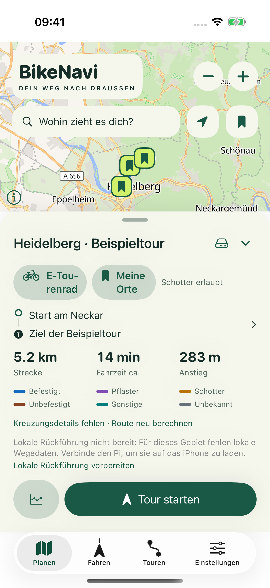 | 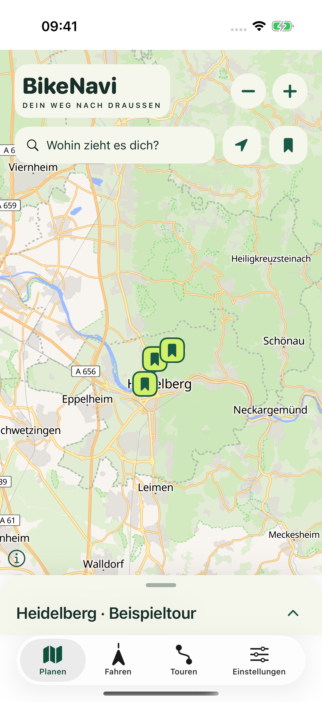 |

| Wegpunkte | Gespeicherte Orte |
| --- | --- |
| 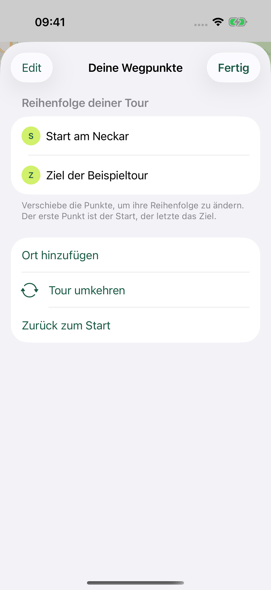 | 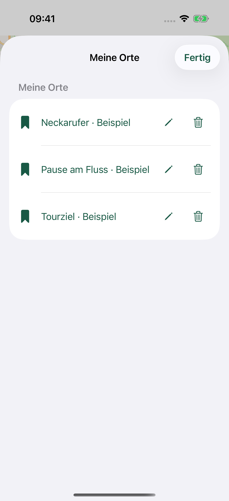 |

| Ortssuche | Fahrprofil |
| --- | --- |
| 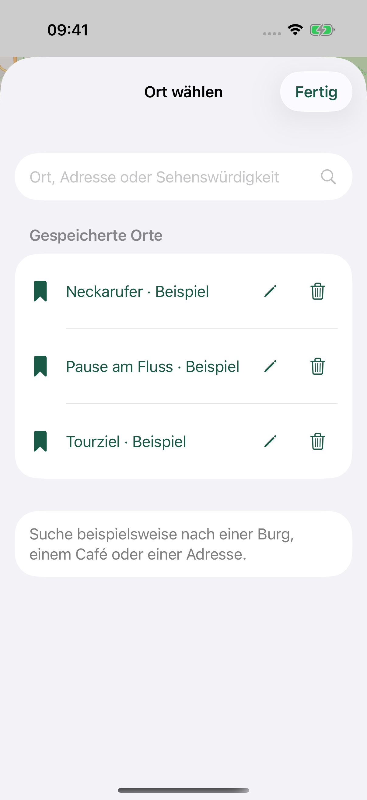 | 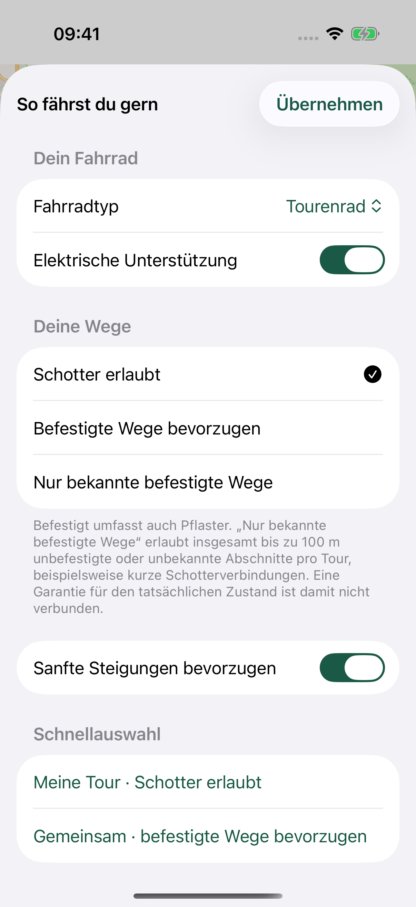 |

| Routendetails |
| --- |
| 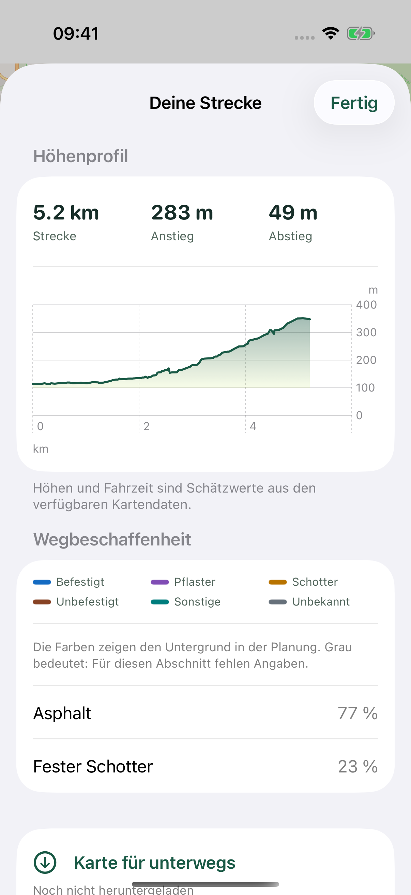 |

## Unterwegs

Die laufende Fahrt verwendet den Standort im unteren Fünftel, 500 m Vorausschau und die maximal mögliche Schrägansicht. Im Simulator fehlen echte Kompass- und Bike-Sensorwerte. Die Pause zeigt absichtlich keine aktive Nachführung.

| Laufende Tour | Pause | Bike-Verbindung |
| --- | --- | --- |
| 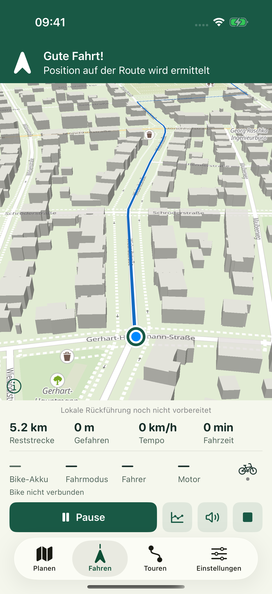 |  | 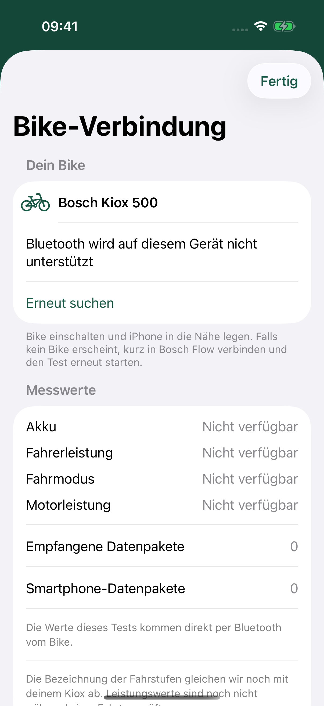 |

## Tourenarchiv und Auswertung

Die Diagramme und Fahrmodusfarben demonstrieren ausschließlich die Darstellung. Sie sind kein Nachweis gemessener Leistungswerte bei einer realen Fahrt.

| Gespeicherte Touren | Fahrt mit Modusfarben | Höhen- und Leistungsverlauf |
| --- | --- | --- |
| 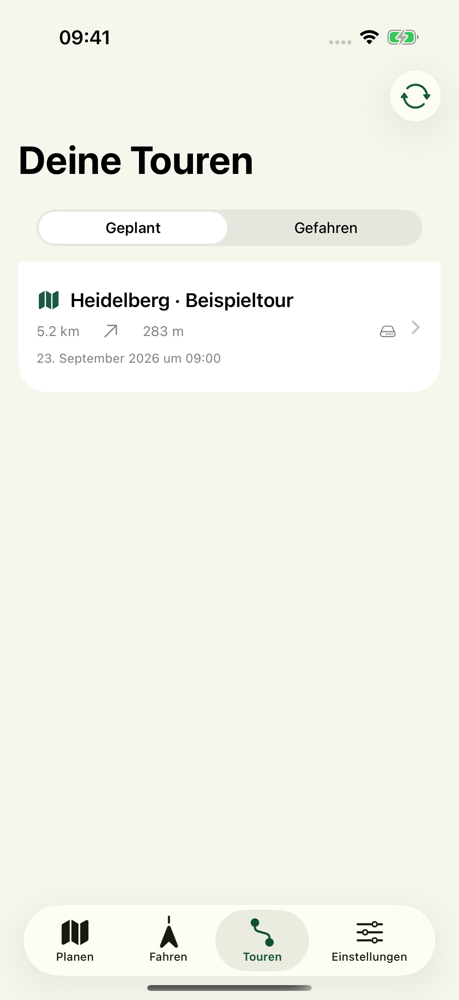 | 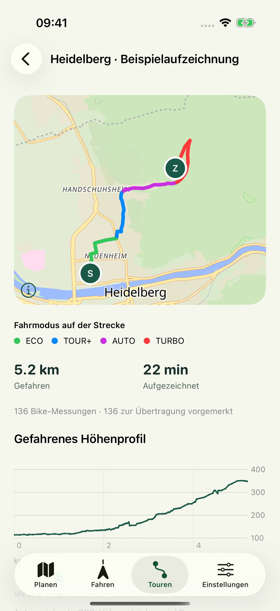 | 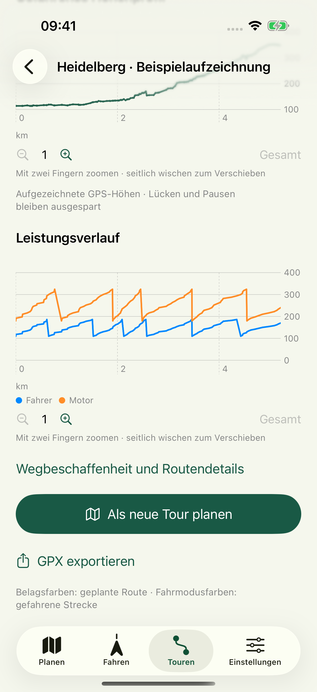 |

## Einstellungen und Logo

| Einstellungen | App-Logo |
| --- | --- |
| 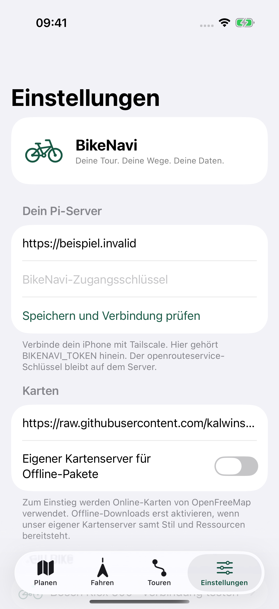 |  |

Original und Entstehung des Logos: [AppIcon.md](../design/AppIcon.md). Die Screenshots zeigen Karten von OpenFreeMap mit Daten von [© OpenStreetMap-Mitwirkenden](https://www.openstreetmap.org/copyright). Quellen des Routenbeispiels: [Testdaten](../tests/fixtures/README.md).

## Bilder erneut erstellen

1. Einen eigenen iPhone-Simulator mit iOS 26.1 starten. Keine persönlichen App-Daten oder Serverzugänge verwenden.
2. Das Scheme `BikeNavi` mit `xcodebuild build-for-testing` für diesen Simulator bauen und die App mit `xcrun simctl install DEVICE APP_PATH` installieren. Bei Bedarf einen eindeutigen `CONFIGURATION_BUILD_DIR` angeben und beim Testlauf denselben Wert verwenden.
3. Beispielbestand vorbereiten:

   ```sh
   python3 scripts/seed_gallery.py --device DEVICE
   xcrun simctl privacy DEVICE grant location-always de.michaelhein.BikeNavi
   xcrun simctl ui DEVICE appearance light
   xcrun simctl status_bar DEVICE override --time '9:41' --dataNetwork wifi --wifiMode active --wifiBars 3 --batteryState charged --batteryLevel 100
   ```

4. Nur `BikeNaviUITests/DocumentationScreenshotsTests` mit `xcodebuild test-without-building`, `-parallel-testing-enabled NO`, dem konkreten Simulatorziel und einem neuen `-resultBundlePath` ausführen. Die Testklasse verwendet eine lokale Beispielplanung und einen simulierten Standort. Für die Fahrtansicht setzt sie `BIKENAVI_PREVIEW_LOCATION=49.414601,8.681496` als ausdrücklich aktivierte Debug-Testposition; Release-Builds enthalten diesen Einstieg nicht. Ohne vorbereiteten Beispielbestand überspringt sie die Galerie.
5. Anhänge mit `xcrun xcresulttool export attachments --path RESULT.xcresult --output-path OUTPUT` exportieren. Die im Manifest benannten `Gallery-…`-Bilder als `01-planen.png` usw. nach `docs/images/` übernehmen.
6. Jedes Bild auf vollständige Ansicht, geladene Karte, korrekte Beschriftung und fehlende private Daten prüfen. Nach Abschluss kann der ausschließlich dafür angelegte Simulator entfernt werden.

Die Galerie zeigt die zentralen Ansichten, nicht jeden Dialog, jede Fehlermeldung oder die separate Live-Aktivität auf dem Sperrbildschirm.
