# BikeNavi – Bildschirmgalerie

Version **0.4.0 (4)** · iPhone-Simulator, helle Darstellung. Planung und Routendetails am 24. September 2026 mit Höhenprofil und getrenntem lokalem Umfeld aktualisiert; Planungs-/Fahrtkarten und Einstellungen am 5. Oktober 2026 mit Kartenansichten aktualisiert; Ortssuche am 1. Oktober 2026 mit lokaler Koordinatenerkennung aktualisiert; Fahrprofil am 5. Oktober 2026 mit Rad-/Wanderoptionen aktualisiert; übrige Bilder vom 23. September 2026.

Die Bilder zeigen die tatsächlich laufende App. Die Route stammt aus dem öffentlichen Heidelberg-Beispiel von openrouteservice. Die gespeicherte **Beispielaufzeichnung**, ihre Zeit-/GPS-Samples und ihre Bike-Messwerte sind synthetische Demonstrationsdaten. In der Live-Fahrt ist kein echtes Bike verbunden: fehlende Messwerte bleiben leer. Persönliche Touren und Zugangsdaten sind nicht enthalten. Die Serveradresse `beispiel.invalid` ist ein nicht erreichbarer Platzhalter; ein vorbereitetes lokales Wegenetz ist für dieses alte ORS-Beispiel nicht vorhanden.

Die aktualisierten Ansichten **01** und **07** zeigen die nachträglich über SRTM ergänzten und lokal gespeicherten Höhen der öffentlichen Heidelberg-Beispielgeometrie. Der UI-Test hat Anzeige und Wiederöffnen ohne konfigurierten Serverzugang geprüft. Das Beispiel enthält kein vorbereitetes Offline-Wegenetz; der entsprechende Hinweis in der Planung ist daher erwartet. Die Aufnahmen wurden nach der Umstellung auf das mitwandernde 3-km-Umfeld erneut erstellt und geprüft. Die gespeicherte Route und der Fahrtstart bleiben auch ohne Umfelddaten verfügbar.


Am **9. Oktober 2026** wurden **01** (belagsabhängige Fahrzeit), **12/14** (ETA während Fahrt/Pause) und **42/43** (Blogfortschritt) aktualisiert bzw. ergänzt. Alle verwenden ausschließlich die öffentliche Heidelberger Beispielgeometrie und synthetische Aufzeichnungsdaten. **42/43** zeigen einen kontrolliert verzögerten lokalen HTTPS-Testserver, keinen echten Pi-/KI-Lauf. Die Anzeige „auf dem Pi gespeichert“ steht dort für den protokollgleichen lokalen Beispielserver. Der UI-Test prüft die echte HTTP-Auftragsannahme, Phasen, gesperrte Erstellungstaste und Wiederaufnahme nach Ansichtswechsel und App-Neustart; die Screenshots wurden visuell geprüft.

| Blog: Vorbereitung mit Zeitrückmeldung | Blog: Schreibphase nach App-Neustart |
| --- | --- |
| 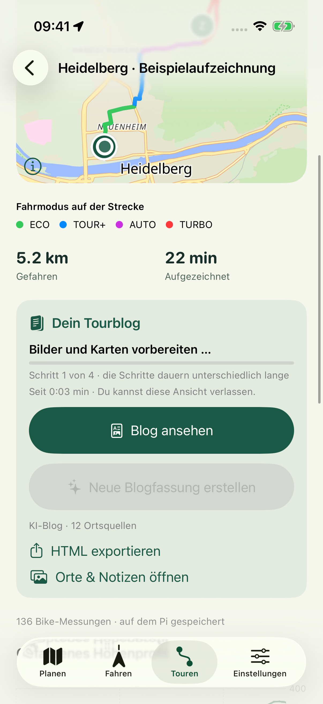 | 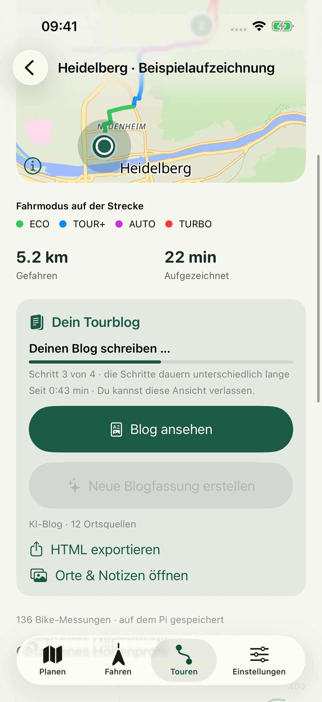 |

## Planung

| Tour planen | Karte mit eingeklappten Daten |
| --- | --- |
| 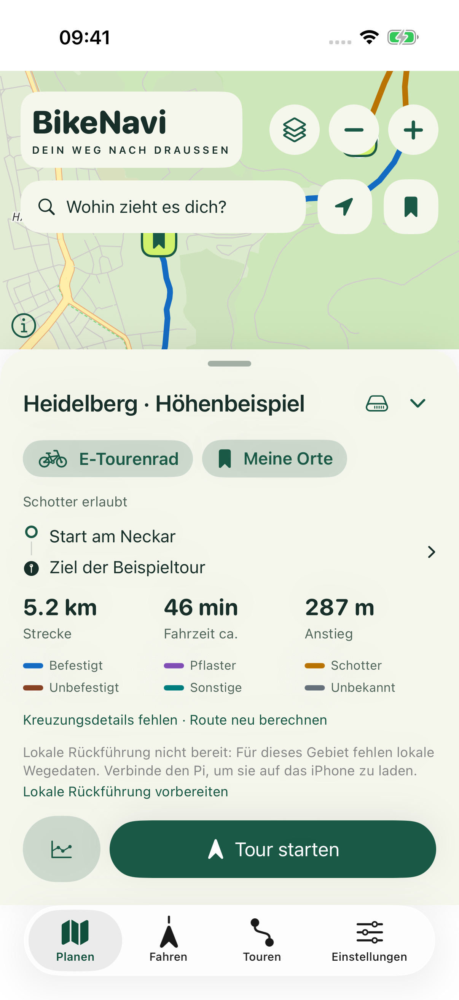 | 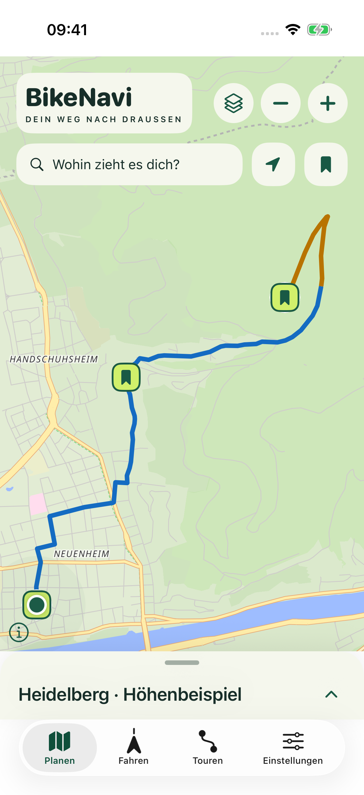 |

| Wegpunkte | Gespeicherte Orte |
| --- | --- |
| 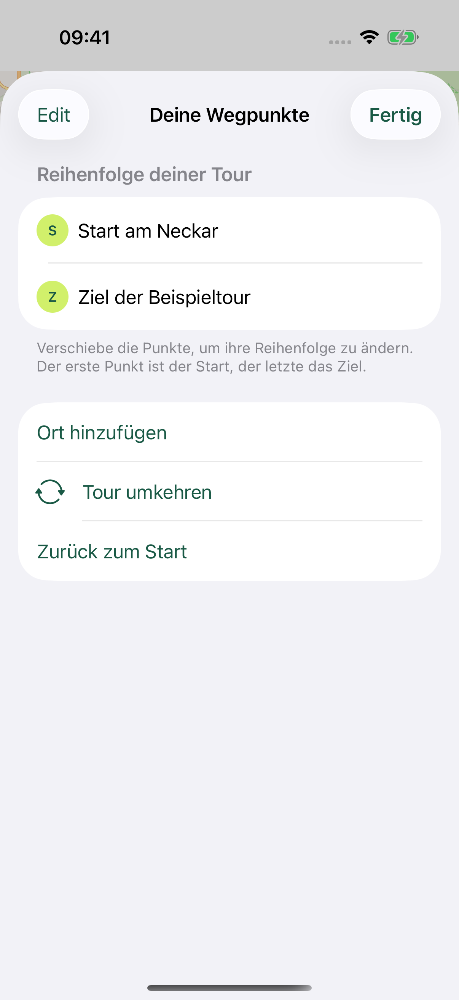 | 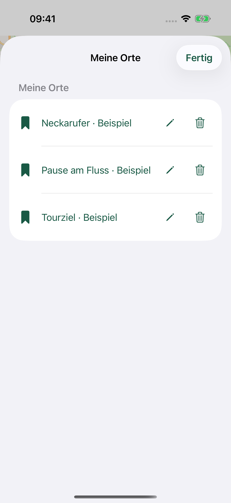 |

| Ortssuche | Fahrprofil |
| --- | --- |
| 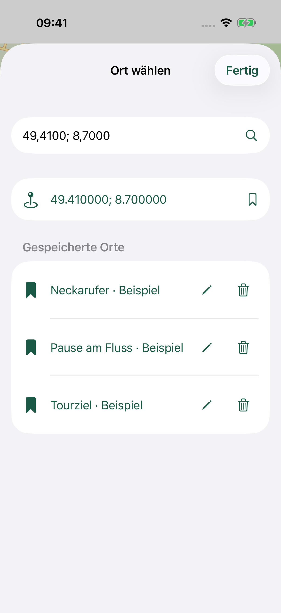 | 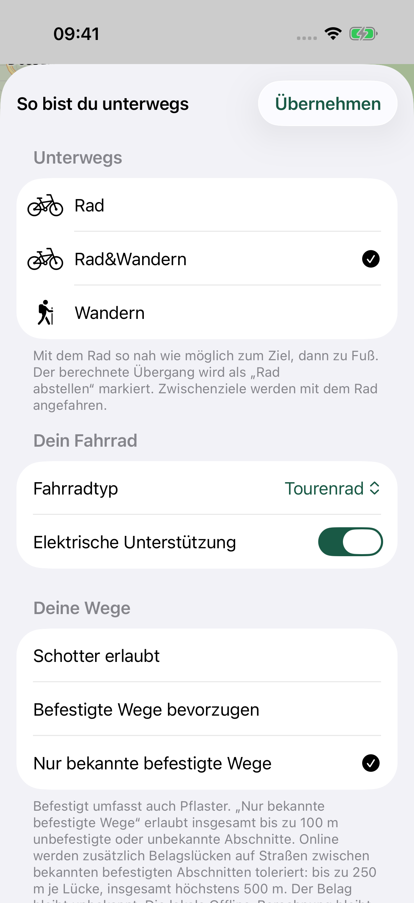 |

| Routendetails |
| --- |
| 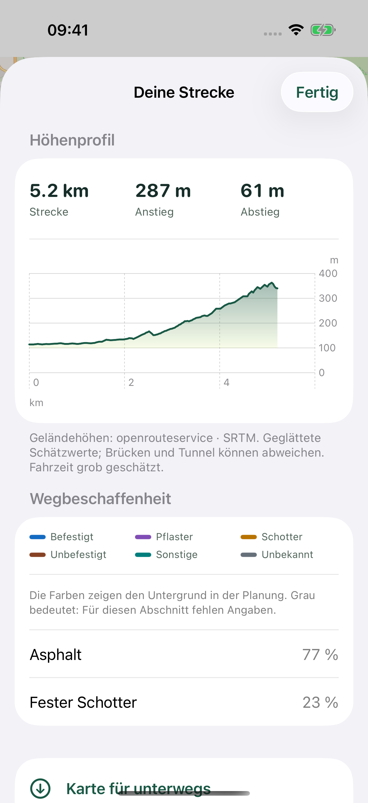 |

Die Ortssuche **05** zeigt die Eingabe `49,4100; 8,7000` und den lokal normalisierten Treffer eines öffentlichen **Beispielpunkts** in Heidelberg. Treffer stehen vor den gespeicherten Orten; beim Suchen schließt sich die Tastatur. Der Simulator-Test prüft die Suche ohne Server sowie die Übernahme in die Tour. Auch die Nutzereingabe `43.80104 N, 15.78955 E` und der kurze Plus Code `2WF2+8F Rodgau` sind durch Kerntests abgedeckt; die Abbildung verwendet ausschließlich den Heidelberger Beispielbestand.

## Rad&Wandern und Wandern

Am 5. Oktober 2026 im separaten Dokumentationssimulator aufgenommen. **06** zeigt die neue Auswahl **Rad**, **Rad&Wandern**, **Wandern**. Der UI-Test prüft Auswahl, ausgeblendete Fahrradoptionen bei Wanderung und die Speicherung nach App-Neustart. **17** zeigt das konservative Wanderprofil und den Link zur freien Wanderübersicht Waymarked Trails.

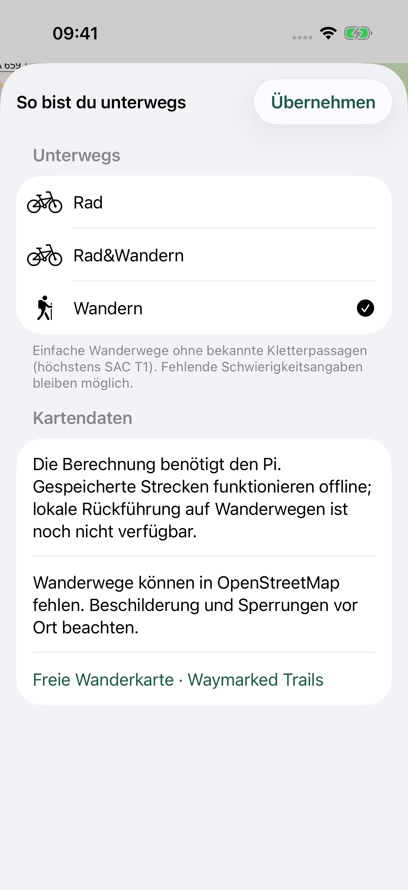

Die Aufnahmen **18** und **19** verwenden ausschließlich eine **synthetische Rad-/Wanderaufteilung** der öffentlichen Heidelberger Beispielgeometrie für die Darstellung. Der Titel und die Routenwarnung kennzeichnen dies; die dargestellte Abstellposition ist kein live berechneter Stellplatz und kein Feldtest. Der UI-Test prüft getrennte Entfernungen und Abstellkoordinaten ohne Serverzugang. In echten Berechnungen entsteht der Übergang nur aus verbundenen Rad-/Fußrouten.

| Abstellpunkt auf der Planungskarte | Rad-/Wanderabschnitte in den Details |
| --- | --- |
| 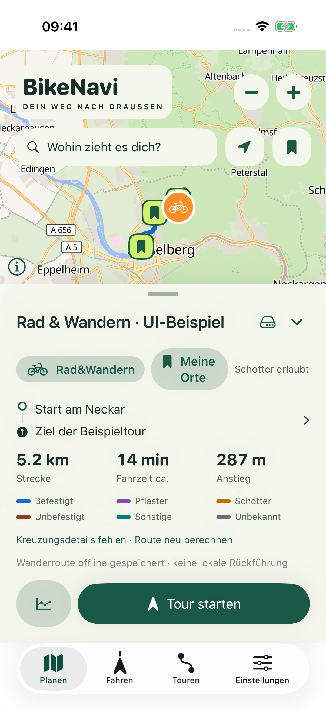 | 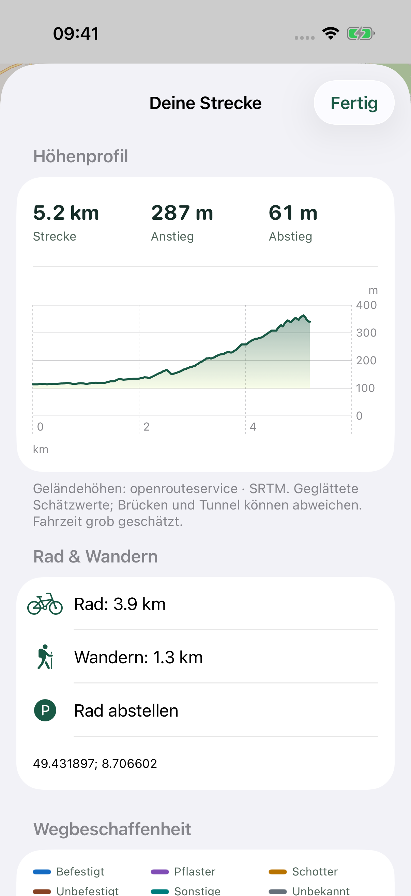 |

### POI außerhalb des erfassten Wegenetzes

Neue Aufnahmen **20** und **21** vom 5. Oktober 2026 zeigen die Korrektur für Ziele abseits des erfassten Wegenetzes. Ausschließlich **synthetisches UI-Beispiel** auf Basis der öffentlichen Heidelberger Route: Zielpunkt um etwa 319 m versetzt, kein tatsächlicher Fußweg und keine private POI-Position. Der Test prüft sichtbare Radanfahrt, terminalen Abstellmarker und ausdrücklichen Hinweis auf den nicht berechneten Fußrest. Die tatsächlichen privaten Testkoordinaten sind weder in der Galerie noch in den Fixtures enthalten.

| Fehlende Wegdaten zum POI | Nicht berechneter Fußrest |
| --- | --- |
| 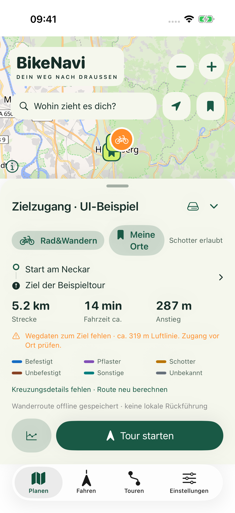 | 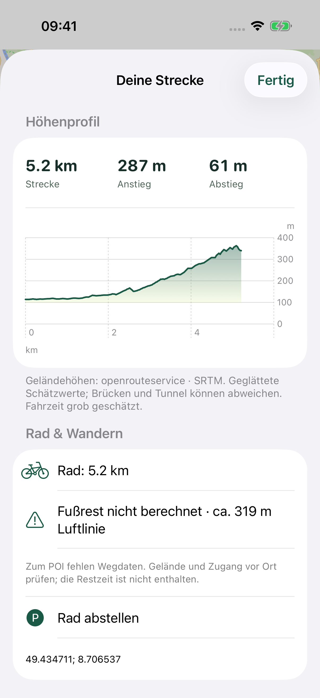 |

## Kartenansichten

Neu am 5. Oktober 2026: Das Ebenensymbol in Planung und Fahrt öffnet die Kartenwahl; dieselbe Auswahl steht unter Einstellungen → Karten zur Verfügung. Bei jedem vollständigen App-Start erscheint wieder **Standard · Deutsch**. Tabwechsel und kurze Hintergrundpausen erhalten die gewählte Ansicht. Bilder 01/02, 11, 12/14 sowie 25–29 wurden im Simulator mit der öffentlichen, gekennzeichneten Heidelberg-Beispieltour aktualisiert. Satellit ist eine Online-Luftbildkarte ohne Ortsbeschriftungen; Topografisch zeigt OpenTopoMap-Gelände und Höhenlinien. Routing und Wanderprüfung ändern sich dadurch nicht.

| Hell | Detailreich | Dunkel |
| --- | --- | --- |
| 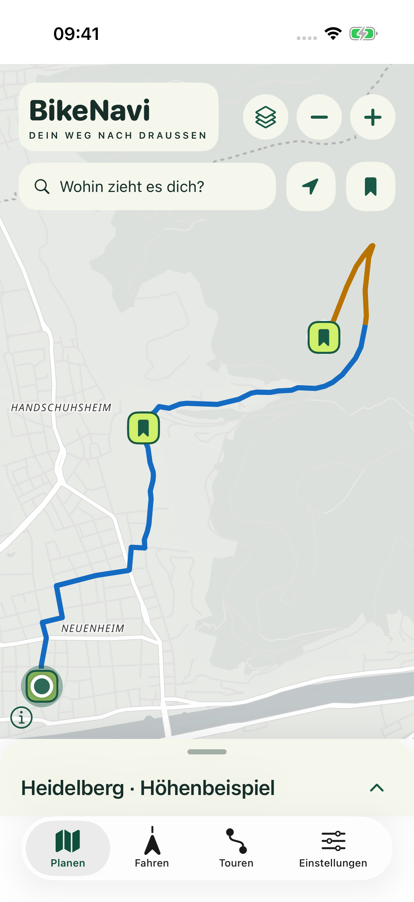 | 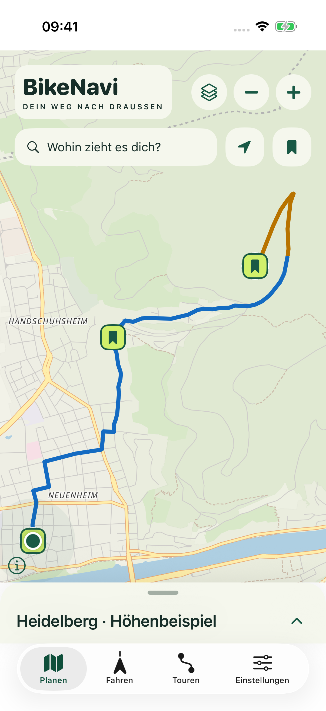 | 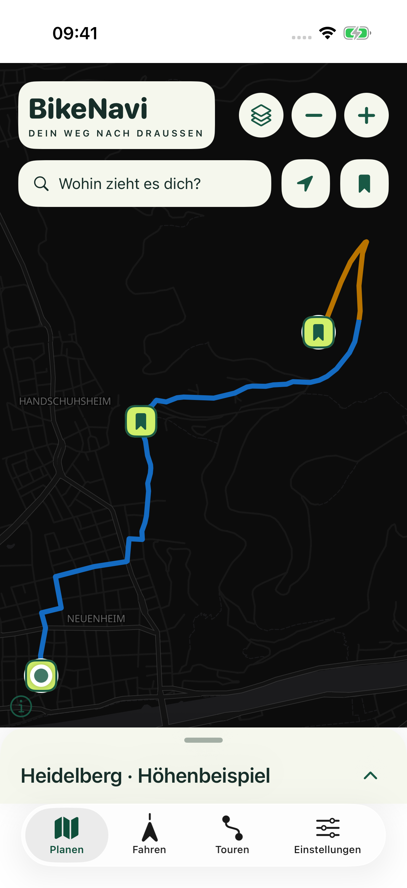 |

| Satellit | Topografisch |
| --- | --- |
| 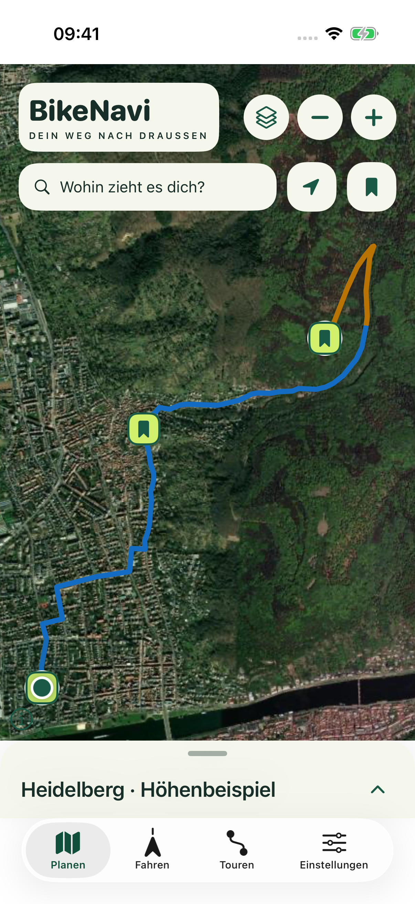 | 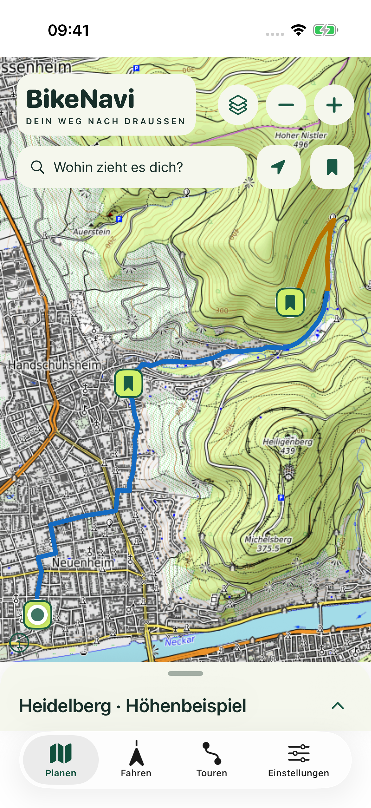 |

Satellitenbilder: Esri World Imagery · Source: Esri, Vantor, Earthstar Geographics, and the GIS User Community. Topografische Kartendaten: © OpenStreetMap-Mitwirkende, SRTM; Kartendarstellung: © [OpenTopoMap](https://opentopomap.org/about) ([CC-BY-SA](https://creativecommons.org/licenses/by-sa/3.0/)). Die Quellhinweise sind zusätzlich über die Karteninformation der App erreichbar. Die Rasterauflösung ist quellenabhängig; größere Zoomstufen vergrößern vorhandene Bildkacheln. Keine Offline-Pakete oder Feldtests.

## Unterwegs

### Standort beim Fahrtstart

Neu am 25. September 2026: Der Fahrtstart wartet bis zu 15 Sekunden auf eine frische Position. Die Standortsuche kann abgebrochen werden. Aufnahme aus dem Simulator mit ausdrücklich synthetischen Standort-Testdaten einer **Beispieltour** in Heidelberg; kein GPS-Feldtest. Die UI-Prüfung liefert den Beispielstandort verzögert und prüft den anschließenden automatischen Fahrtstart.

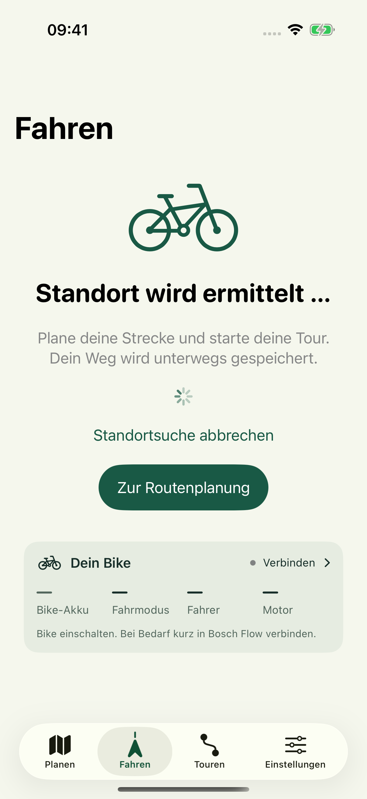


Die laufende Fahrt verwendet den Standort im unteren Fünftel, 500 m Vorausschau und die maximal mögliche Schrägansicht. Im Simulator fehlen echte Kompass- und Bike-Sensorwerte. Die Pause zeigt absichtlich keine aktive Nachführung.

| Laufende Tour | Pause | Bike-Verbindung |
| --- | --- | --- |
| 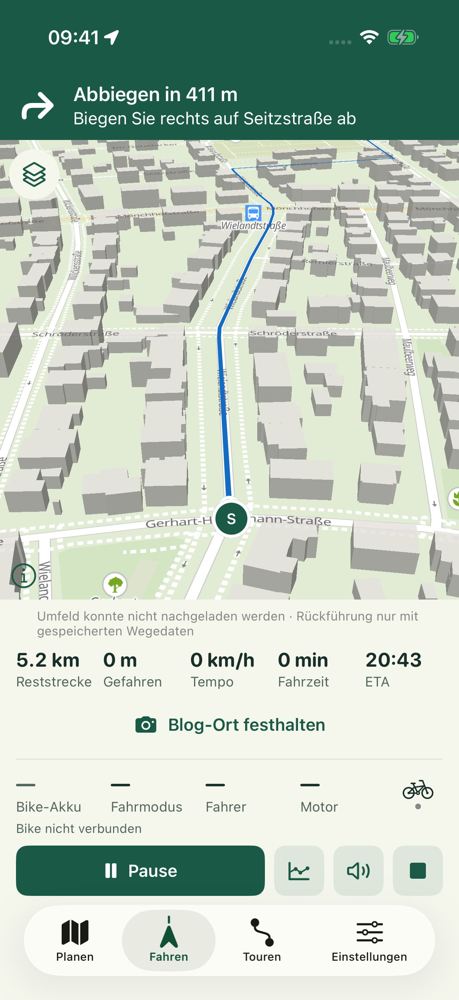 | 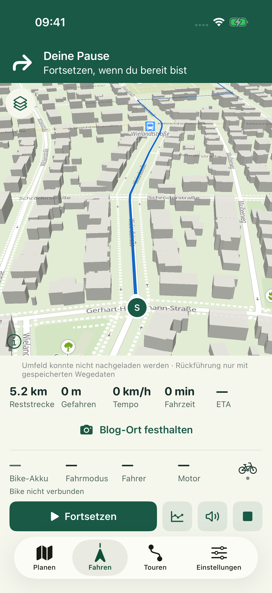 | 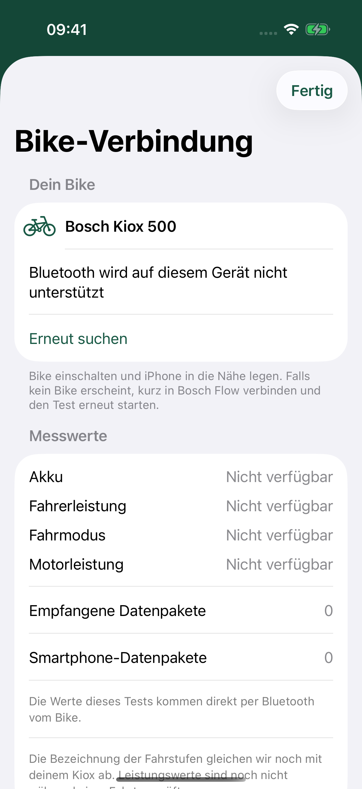 |

### Zwischenziele überspringen

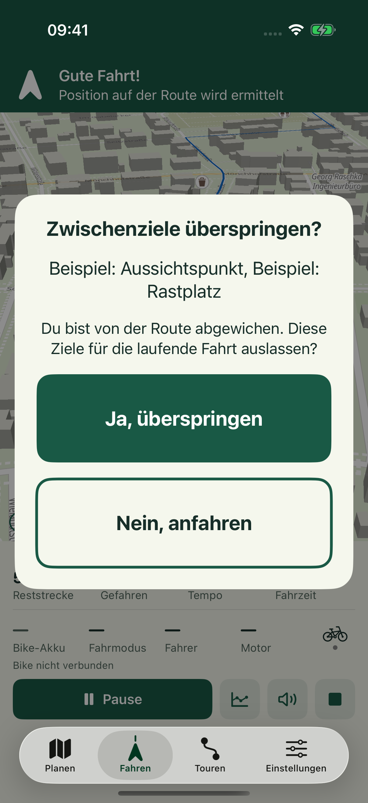

Am 24. September 2026 im Simulator aufgenommen. Beide Tasten sind mindestens 96 Punkte hoch. Die zwei zusätzlich eingefügten Zwischenziele sind ausdrücklich als Beispiele gekennzeichnet. Der Debug-Einstieg `BIKENAVI_PREVIEW_SKIP=1` erzeugt die Dialogsituation für `DocumentationScreenshotsTests/testWaypointSkipLargeButtons`; er ist kein GPS-Feldtest und in Release-Builds nicht enthalten. Der Test prüft beide Tasten und ihre Mindesthöhe. Zum Wiederholen zuerst den normalen Galerie-Beispielbestand neu einspielen.

## Tourenarchiv und Auswertung

Die Diagramme und Fahrmodusfarben demonstrieren ausschließlich die Darstellung. Sie sind kein Nachweis gemessener Leistungswerte bei einer realen Fahrt.

| Gespeicherte Touren | Fahrt mit Modusfarben | Höhen- und Leistungsverlauf |
| --- | --- | --- |
| 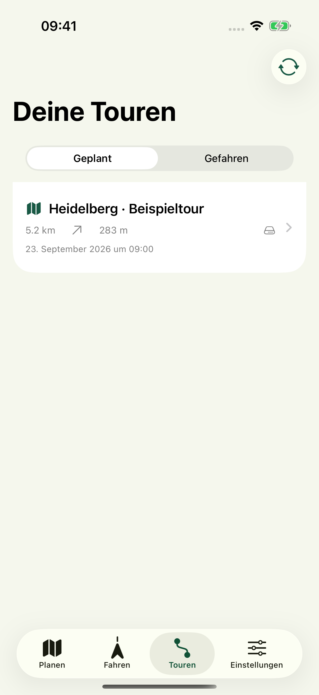 | 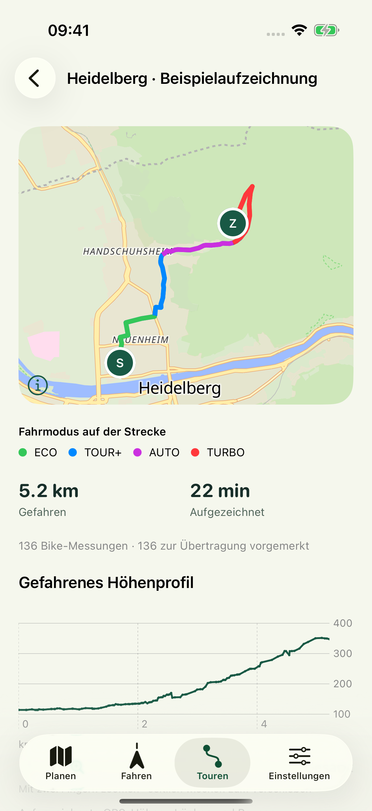 | 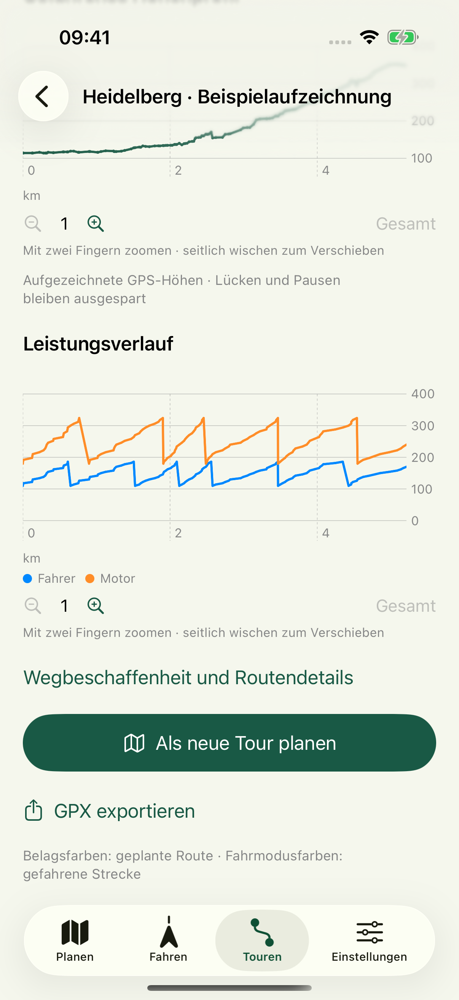 |

## Einstellungen und Logo

Die zusätzliche BikeNavi-Titelbox wurde entfernt; die Pi-Server-Einstellungen folgen direkt auf die Lautstärke. Die erste Box regelt auf dem echten iPhone direkt die System-Medienlautstärke über Apples nativen Regler. Die Aufnahme vom 29. September 2026 zeigt den ausdrücklichen Simulatorhinweis, da iOS im Simulator keinen funktionsfähigen Systemregler bereitstellt. Der UI-Test prüft die Position der Box, den Hörprobenknopf und den Wechsel zwischen Reitern. Kopplung mit den Hardwaretasten und hörbare Lautstärke sind am iPhone zu prüfen.

| Einstellungen | App-Logo |
| --- | --- |
| 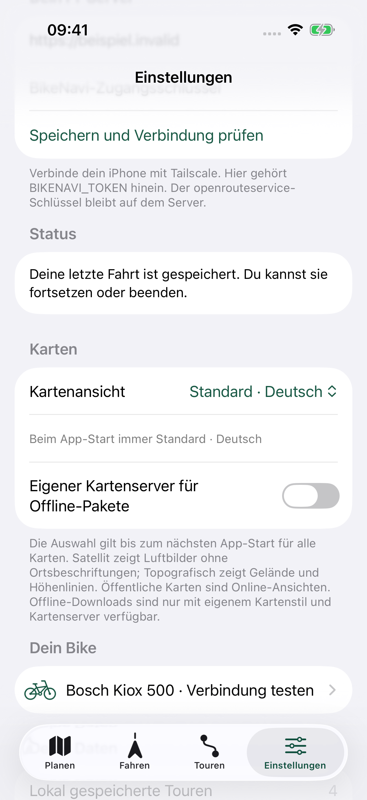 |  |

Original und Entstehung des Logos: [AppIcon.md](../design/AppIcon.md). Die Screenshots zeigen Karten von OpenFreeMap mit Daten von [© OpenStreetMap-Mitwirkenden](https://www.openstreetmap.org/copyright). Quellen des Routenbeispiels: [Testdaten](../tests/fixtures/README.md).

## Bilder erneut erstellen

1. Einen eigenen iPhone-Simulator mit iOS 26.1 starten. Keine persönlichen App-Daten oder Serverzugänge verwenden.
2. Das Scheme `BikeNavi` mit `xcodebuild build-for-testing` für diesen Simulator bauen und die App mit `xcrun simctl install DEVICE APP_PATH` installieren. Bei Bedarf einen eindeutigen `CONFIGURATION_BUILD_DIR` angeben und beim Testlauf denselben Wert verwenden.
3. Beispielbestand vorbereiten:

   ```sh
   python3 scripts/seed_gallery.py --device DEVICE
   xcrun simctl privacy DEVICE grant location-always de.michaelhein.BikeNavi
   xcrun simctl ui DEVICE appearance light
   xcrun simctl status_bar DEVICE override --time '9:41' --dataNetwork wifi --wifiMode active --wifiBars 3 --batteryState charged --batteryLevel 100
   ```

4. Nur `BikeNaviUITests/DocumentationScreenshotsTests` mit `xcodebuild test-without-building`, `-parallel-testing-enabled NO`, dem konkreten Simulatorziel und einem neuen `-resultBundlePath` ausführen. Die Testklasse verwendet eine lokale Beispielplanung und einen simulierten Standort. Für die Fahrtansicht setzt sie `BIKENAVI_PREVIEW_LOCATION=49.414601,8.681496` als ausdrücklich aktivierte Debug-Testposition; Release-Builds enthalten diesen Einstieg nicht. Ohne vorbereiteten Beispielbestand überspringt sie die Galerie.
5. Anhänge mit `xcrun xcresulttool export attachments --path RESULT.xcresult --output-path OUTPUT` exportieren. Die im Manifest benannten `Gallery-…`-Bilder als `01-planen.png` usw. nach `docs/images/` übernehmen.
   Für die Höhen-Erweiterung zunächst `scripts/seed_gallery.py --device DEVICE --elevation` ausführen und gezielt `DocumentationScreenshotsTests/testCaptureSavedElevationOffline` starten. Dieser Lauf erzeugt die aktualisierten Bilder 01 und 07 und prüft das erneute Öffnen des Profils ohne Serverzugang.

   Für die Kartenwahl den öffentlichen Bestand mit `--elevation` vorbereiten und `MapStyleTests/testStylesSwitchAcrossTabsAndRestartWithGermanDefault` ausführen. Der Test erzeugt Bilder 01/02, 11 und 25–29 und prüft Auswahl, Tabwechsel, Hintergrundpause und Neustartstandard. `DocumentationScreenshotsTests/testCaptureRideScreenshots` erneuert 12/14 mit dem Ebenensymbol in der Fahrt.

   Für den Lautstärkeregler gezielt `SettingsVolumeTests/testSystemVolumeBoxIsFirstAndOffersPreview` ausführen; dessen Anhang `Gallery-11-einstellungen` aktualisiert Bild 11.

   Für die Koordinatensuche `CoordinateSearchTests/testCoordinateSearchWithoutServerAndSelection` ausführen. Der Anhang `Gallery-05-suche` aktualisiert Bild 05; der Test verwendet den öffentlichen Heidelberger Beispielpunkt, ohne Serverzugang.

6. Jedes Bild auf vollständige Ansicht, geladene Karte, korrekte Beschriftung und fehlende private Daten prüfen. Nach Abschluss kann der ausschließlich dafür angelegte Simulator entfernt werden.

Die Galerie zeigt die zentralen Ansichten, nicht jeden Dialog, jede Fehlermeldung oder die separate Live-Aktivität auf dem Sperrbildschirm.


## Belagswunsch eindeutig in der Planung

Die Aufnahmen **22** und **23** zeigen dieselbe gekennzeichnete synthetische Heidelberg-Beispielplanung. Die Planung nennt den vollständigen Belagswunsch in einer eigenen Zeile unter den Profiltasten, sodass die strenge Auswahl von der bloßen Bevorzugung unterscheidbar ist. Der Simulator-Test prüft beide Anzeigen und die Persistenz der strengen Auswahl nach Neustart. Die Beispielroute dient hier nur der Darstellung der Auswahl, nicht als Berechnung mit der dargestellten Belagsoption.

| Nur bekannte befestigte Wege | Befestigte Wege bevorzugen |
| --- | --- |
|  | 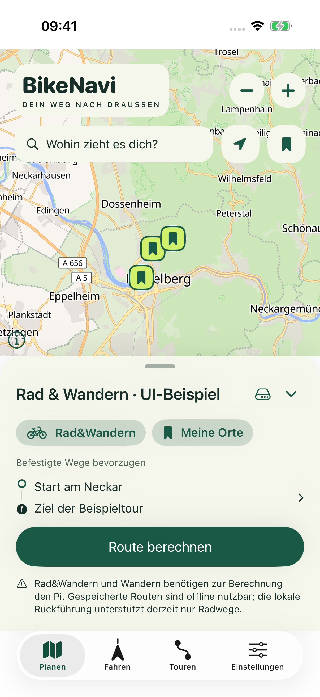 |

Für diese Bilder den synthetischen Bestand mit `seed_gallery.py --bike-and-hike` vorbereiten und gezielt `WalkingOptionsTests/testPlanningDistinguishesPreferredAndStrictPaving` ausführen.


## Toleranz für kurze Straßen-Belagslücken

Aufnahme **24** zeigt im Profil die Online-Ausnahme für fehlende Beläge zwischen bekannten befestigten Straßenabschnitten (250 m je Lücke, 500 m insgesamt) sowie die weiterhin strengere lokale Offlinegrenze. Der Simulator-Test prüft den sichtbaren Hinweis anhand derselben öffentlichen, gekennzeichneten Beispielplanung. Profilbild **06** wurde mit dem aktuellen Text ebenfalls erneuert.

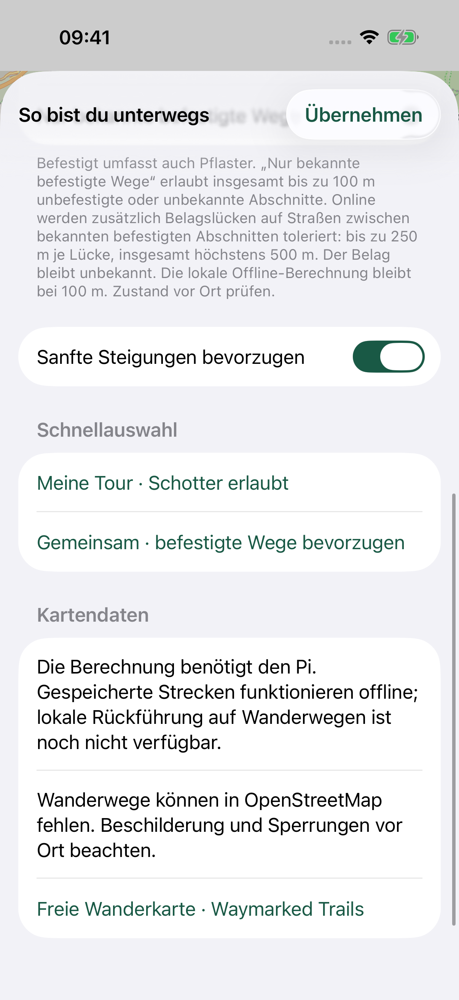


## Tourtagebuch und Blog

Aufnahme **12** wurde mit der Taste **Blog-Ort festhalten** erneuert. **30** zeigt eine rein synthetische Notiz an einem öffentlichen Heidelberger Standort; im Simulator wird die Kameraaufnahme mangels Kamera nicht angeboten. **31** zeigt gespeicherte, noch nicht übertragene Beispielstationen sowie die neuen Aktionen zum Hinzufügen und Bearbeiten im Tourtagebuch. Der UI-Test prüft Speicherung ohne Server, Erhalt nach Neustart und einen verständlichen Hinweis bei Blogerstellung ohne Pi-Konfiguration.

| Ort festhalten | Tourtagebuch |
| --- | --- |
| 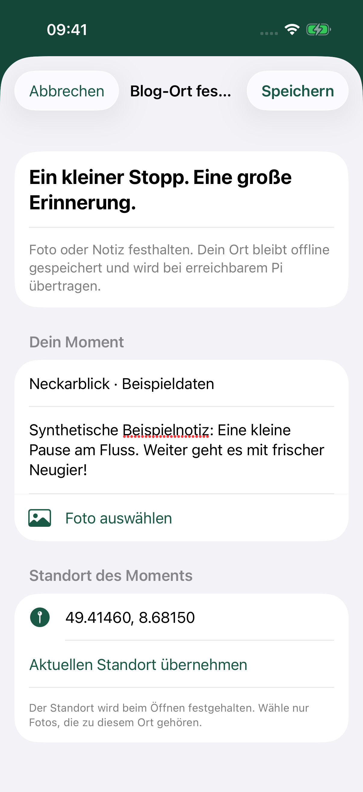 | 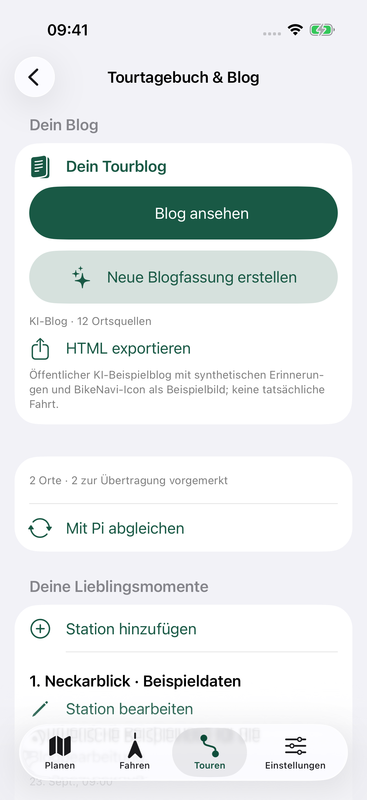 |

Die Blogvorschau verwendet einen auf dem Pi tatsächlich erzeugten KI-Blog zu öffentlichen Heidelberger Orten. Die Erinnerungen und Fahrtaufzeichnung sind synthetisch; das als Beispielbild gekennzeichnete BikeNavi-Icon ist kein Reisefoto. Kartenkacheln und Recherchequellen sind real. Das [portable HTML-Beispiel](examples/heidelberg-blog.html) enthält alle Bilder und Karten direkt.

**32–34** zeigen den Titelbereich, die große topografische Streckenübersicht und einen Detailausschnitt mit markiertem Beispielort. Die Vorschauprüfung wartet auf den abgeschlossenen HTML-Ladevorgang und prüft den sichtbaren Kartenausschnitt. Die Aufnahme der großen Karte scrollt zusätzlich gezielt zur vollständigen Übersicht. Alle Aufnahmen wurden visuell kontrolliert.

| KI-Blogvorschau | Topografische Streckenübersicht | Topografische Details |
| --- | --- | --- |
| 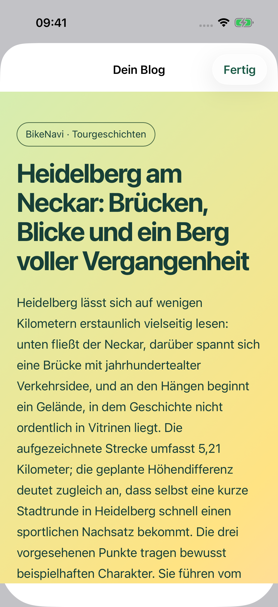 | 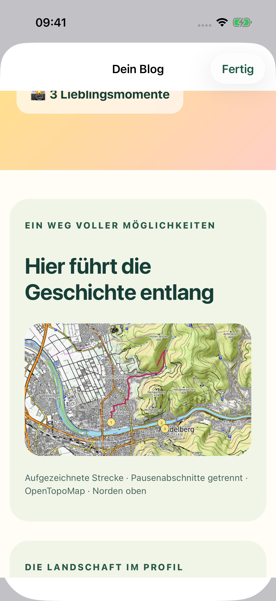 | 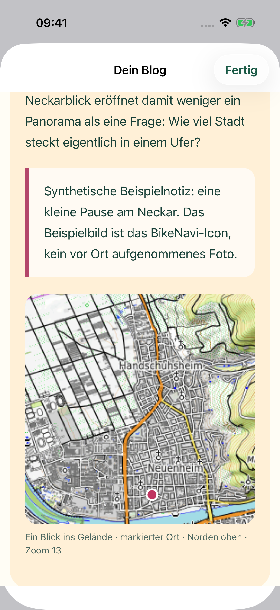 |

Topografische Kartendaten: © [OpenStreetMap-Mitwirkende](https://www.openstreetmap.org/copyright), SRTM · Darstellung: © [OpenTopoMap](https://opentopomap.org), [CC BY-SA 3.0](https://creativecommons.org/licenses/by-sa/3.0/). Lizenz- und Quellenangaben sind im HTML ebenfalls enthalten.

Für reproduzierbare Aufnahmen: Dokumentationssimulator mit `seed_gallery.py --device UUID --elevation --blog docs/examples/heidelberg-blog.html` vorbereiten; gezielt `DocumentationScreenshotsTests/testBlogPointOfflineAndJournalScreens` und `DocumentationScreenshotsTests/testBlogHTMLPreviewWithPublicExample` ausführen. Kein Feldtest.


## Direkter Blogzugang und beschriftetes Höhenprofil

**35** zeigt den direkten Bloglink unter den Kennzahlen einer gefahrenen Beispieltour. **36** zeigt denselben Zugang in der zugehörigen archivierten Planung. **31** wurde erneuert: „Blog erstellen“ steht im Tourtagebuch vor den Bildern. **37** zeigt die numerischen Achsen: Höhe in Metern links, Strecke in Kilometern unten. Die große Streckenkarte **33** nutzt jetzt eingebettete OpenTopoMap-Kacheln mit der Route.

| Gefahrene Tour | Zugehörige Planung | Profil mit m/km |
| --- | --- | --- |
| 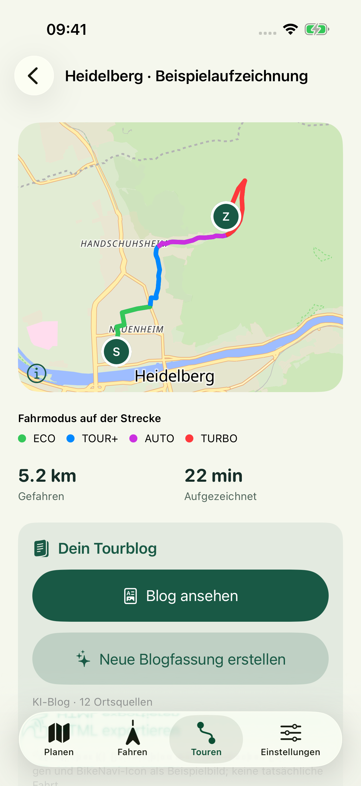 | 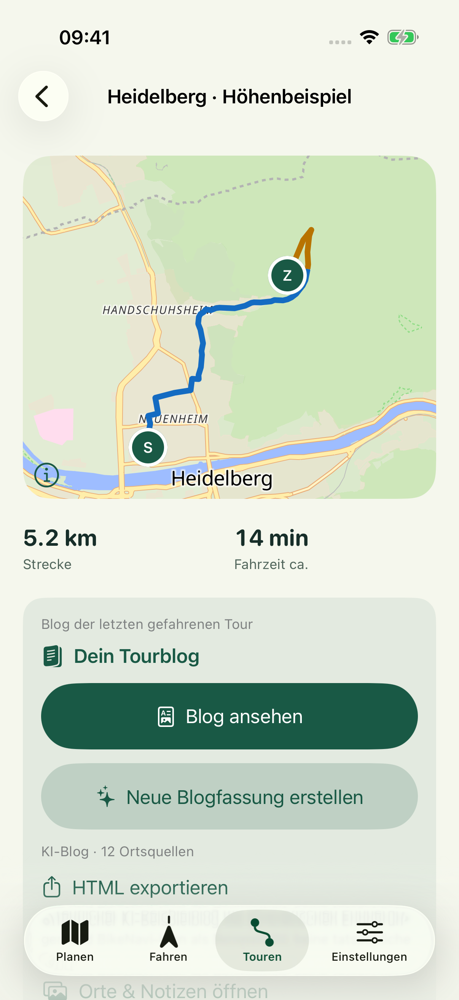 | 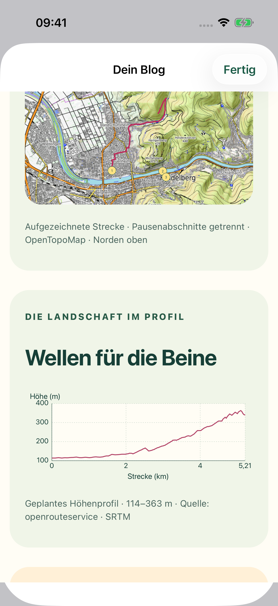 |

Alle Aufnahmen mit öffentlichen, gekennzeichneten Heidelberger Beispielen geprüft. Der UI-Test prüft zusätzlich die Wiederherstellung einer veralteten Positionsmeldung durch einen verzögert gelieferten frischen Beispiel-Fix. Kameraberechtigung und tatsächliche GPS-Erneuerung im Stand bleiben Geräteprüfungen.


## Versionsanzeige 0.4.0

Die Blogaufnahmen 30–37 wurden für Release 0.4.0 (4) mit dem aktualisierten öffentlichen HTML-Beispiel erneuert. Die Einstellungen **11** wurden ebenfalls erneuert. **38** zeigt die tatsächliche Versions- und Buildnummer aus dem Simulator-App-Bundle. Kein Feldtest und keine echte Serveradresse/Zugangsdaten im Bild.

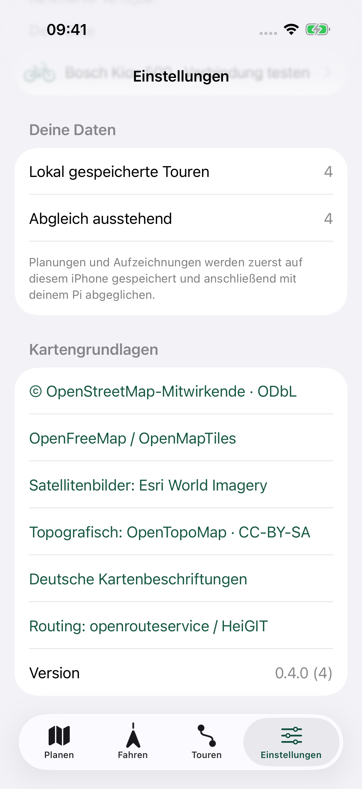

## Stationen nachtragen und bearbeiten

**39** zeigt den Nachtrag einer Station aus einem Bild mit GPS-Standort. **40** zeigt die gewählte Position nach einer vorhandenen Station; das sichtbare Bild ist ein ausdrücklich beschriftetes synthetisches GPS-Testbild am öffentlichen Heidelberger Standort. **41** zeigt die Positionswahl beim Bearbeiten einer bestehenden Station und deren Verschiebung an den Anfang. Nach **Speichern** bleiben die Änderungen offline und nach Neustart erhalten; eine neue Blogfassung übernimmt sie nach dem Pi-Abgleich.

| Station hinzufügen | Position des Nachtrags | Station bearbeiten |
| --- | --- | --- |
| 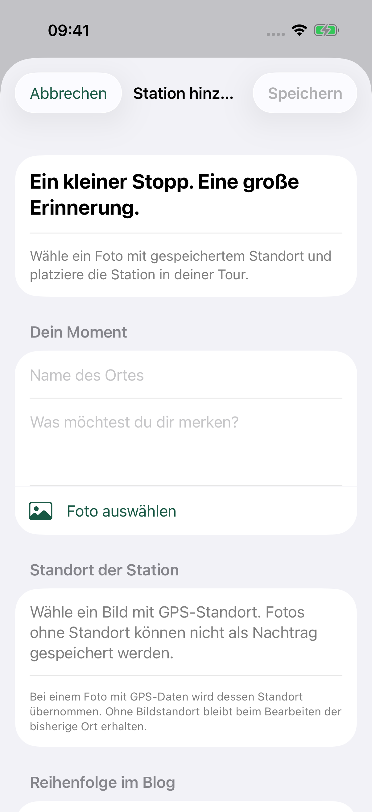 | 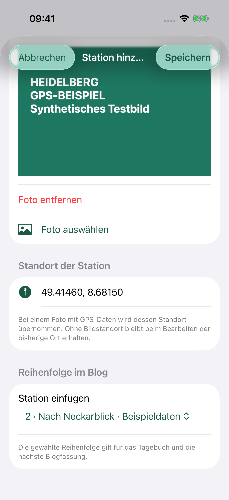 | 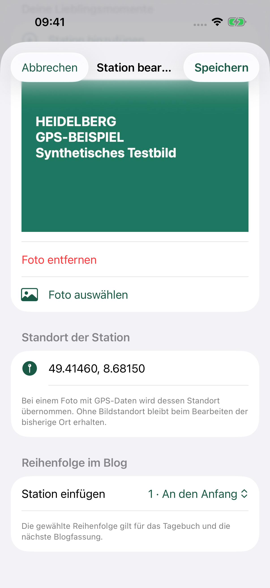 |

Reproduzierbar mit `seed_gallery.py --device UUID --elevation --blog docs/examples/heidelberg-blog.html --journal` und `DocumentationScreenshotsTests/testBlogStationInsertEditOrderAndOfflineRestart`. Der Test verwendet den echten System-Fotopicker im Simulator. GPS-Extraktion, fehlende/ungültige Bildkoordinaten, alte Ortsdaten und revisionsgeprüfter Abgleich werden zusätzlich durch Swift-/Backendtests geprüft. Reale iPhone-/iCloud-Fotoauswahl bleibt separat zu prüfen; kein Feldtest.
