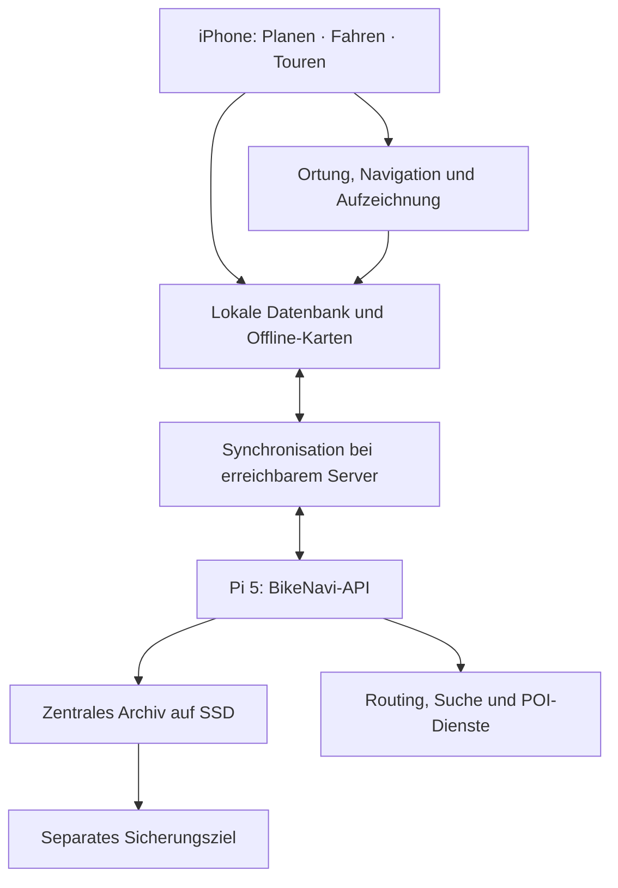

# BikeNavi – Produkt- und Architekturkonzept

Stand: 18. September 2026. Arbeitsstand für die Konzeptphase.

## 1. Bestätigte Anforderungen

- Native Nutzung auf dem iPhone, Fahrtansicht im Hochformat.
- Vorhandenes Bike-Display: Bosch Kiox 500 am smarten System. Die direkte Bluetooth-Anbindung des iPhones soll zunächst den Akkustand in BikeNavi liefern; Fahrmodus sowie Motor- und Fahrerleistung sind optionale Zusatzwerte. Der Verbindungstest folgt, sobald Michael wieder beim Bike ist. Umfang, bekannte Datenfelder und offene Fragen stehen in der [Machbarkeitsprüfung](KIOX500.md). Navigationshinweise auf dem Kiox werden vorerst nicht weiterverfolgt.
- Frei verfügbare Navigationsdaten als Grundlage.
- Planung direkt auf der Karte: Start am aktuellen Standort oder frei wählbar; Ziel und Zwischenziele über Karte oder Textsuche. Die Route erscheint unmittelbar nach der Berechnung.
- Wegbeschaffenheit und Höhenprofil anzeigen, soweit Daten vorhanden sind.
- Planungen speichern; gefahrene Touren aufzeichnen, speichern und später ansehen.
- Touristische POIs unterstützen die Planung.
- Fahrrad und persönliche Wegvorlieben sind Parameter der Planung. E-Unterstützung bedeutet nicht automatisch, dass Schotter gewünscht ist.
- Vorbereitete Touren ohne Netz begleiten; neue Routen zunächst online berechnen.
- Der vorhandene Raspberry Pi 5 wird zentraler Server und dauerhafter Speicher für geplante und gefahrene Touren.
- Der Pi wird über Tailscale erreichbar gemacht. Diese private Verbindung wird für BikeNavi eingeplant.

Die folgenden technischen Bausteine und Bedienungsdetails sind Vorschläge. Ein Raspberry Pi 5 mit Docker, SSD-Speicher und privatem Tailscale-Zugang ist für das Archiv und die Synchronisation einer persönlichen Installation vorgesehen. Die konkrete Dimensionierung und Sicherungsstrategie werden vor einem produktiven Betrieb geprüft.

## 2. Bedienung

Drei Hauptbereiche: Planen, Fahren und Touren.

### Planen

Die App öffnet die Karte. Der aktuelle Standort ist bei vorhandener Berechtigung als Start vorausgewählt. Start, Ziel und Zwischenziele lassen sich über dieselbe Ortsauswahl bearbeiten. Änderungen lösen eine neue Berechnung aus. Eine aufziehbare Fläche zeigt die Wegpunktliste, das gewählte Profil und die Streckenübersicht. Entwürfe werden lokal automatisch gespeichert und anschließend mit dem Pi abgeglichen.

Fahrradtyp und E-Unterstützung werden getrennt von Untergrund, Wegbreite, Steigungen und Straßenpräferenzen erfasst. Profile können gespeichert und für eine einzelne Planung angepasst werden. Beispiele: eigene Tour mit erlaubtem Schotter und gemeinsame Tour mit bevorzugtem Asphalt. Die genauen Kategorien und Regler werden noch anhand realer Routen festgelegt.

Wünsche und Ausschlüsse sind unterschiedlich zu behandeln: Eine harte Vorgabe darf nicht stillschweigend gelockert werden. Unbekannte Beläge bleiben sichtbar unbekannt. Die Auswahl des Routinganbieters muss berücksichtigen, welche Vorgaben tatsächlich berechnet werden können.

POIs werden nach Kategorien und entlang der Route angeboten. Ein ausgewählter Ort kann als Zwischenziel eingefügt werden. Wenn möglich wird der zusätzliche Fahrweg vorher angezeigt. Rundtouren sowie GPX-Import und -Export sind vorgeschlagene Ergänzungen, deren Priorität noch festzulegen ist.

### Fahren

Oben steht die nächste Abbiegeanweisung mit Entfernung, in der Mitte die Karte, unten eine kleine Auswahl relevanter Werte. Höhenprofil und weitere Daten sind bei Bedarf abrufbar. Pause, Fortsetzen und Beenden sind gut erreichbar. Navigation und Aufzeichnung arbeiten mit den lokal gespeicherten Daten.

### Touren

Planungen und gefahrene Touren werden getrennt dargestellt. Der Pi hält das zentrale Archiv. Das iPhone speichert eine lokale Übersicht und heruntergeladene Details. Eine Tour kann erneut gefahren oder als neue Planung übernommen werden. Alte Touren werden dabei nicht verändert.

## 3. Aufgabenverteilung

| Aufgabe | iPhone | Raspberry Pi 5 |
| --- | --- | --- |
| Oberfläche und Kartenanzeige | SwiftUI und Kartenbibliothek | Liefert benötigte App-Daten |
| Planung | Eingabe, lokale Entwürfe und Vorschau | Versionierte Ablage, Zugang zur Routenberechnung |
| Navigation | Ortung, Routenfortschritt, Hinweise und Abweichungserkennung | Für eine vorbereitete Fahrt nicht erforderlich |
| Aufzeichnung | Laufende lokale Speicherung der GPS-Punkte | Übernahme und dauerhafte Archivierung |
| Profile und Favoriten | Lokale Bearbeitung und Nutzung | Zentraler, synchronisierter Bestand |
| Offline-Pakete | Herunterladen, Vollständigkeit prüfen und lokal bereitstellen | Routenmetadaten bereitstellen; Kartendownloads gemäß Anbieterbedingungen koordinieren |
| Sicherung | Noch nicht übertragene Daten aufbewahren | Regelmäßige Sicherung des Archivs auf ein separates Ziel |

Das Diagramm zeigt die App-Daten und deren Abgleich. Kartendateien können je nach Anbieter direkt vom Kartenserver auf das iPhone geladen werden. Eine Weiterverteilung oder Zwischenspeicherung durch den Pi ist nur einzuplanen, wenn die Anbieterbedingungen dies erlauben.

## 4. Zentraler Speicher und Synchronisation

Der Pi ist die zentrale Sammelstelle und vergibt bestätigte Versionen. Das iPhone hat eine dauerhafte lokale Arbeitskopie und eine Warteschlange für noch nicht übertragene Änderungen. Fehlende Erreichbarkeit verhindert weder das Speichern eines Entwurfs noch das Aufzeichnen einer Fahrt. Neue Routenberechnungen über den Pi erfordern dagegen eine funktionierende Verbindung zu ihm und zum Routingdienst.

Vorgeschlagene Regeln:

1. Jede Planung, Route und Fahrt erhält bereits auf dem iPhone eine eindeutige ID.
2. Änderungen werden zuerst lokal dauerhaft gespeichert und bei nächster geeigneter Gelegenheit übertragen. Die App unterscheidet „Auf diesem iPhone gespeichert“, „Synchronisiert“ und „Synchronisation fehlgeschlagen“.
3. Der Pi bestätigt eine Übertragung erst nach dauerhafter Speicherung. Wiederholte Übertragungen derselben Änderung erzeugen keine Duplikate.
4. Planänderungen beziehen sich auf eine bekannte Serverversion. Treffen verschiedene Bearbeitungen zusammen, bleiben beide Fassungen erhalten, bis der Konflikt aufgelöst ist. Ein einfaches Überschreiben anhand der Geräteuhr wird vermieden.
5. GPS-Aufzeichnungen werden in nummerierten Abschnitten übertragen. Der Server erkennt bereits vorhandene Abschnitte und bestätigt eine abgeschlossene Tour erst nach Prüfung ihrer Vollständigkeit.
6. Während einer Fahrt wird die aktive Route nicht durch einen Hintergrundabgleich ersetzt. Eine neue Route wird ausdrücklich aktiviert.
7. „Vom iPhone herunterladen entfernen“ und „Tour aus dem Archiv löschen“ sind getrennte Aktionen. Löschungen werden mit synchronisiert, damit alte Geräte Daten nicht unbemerkt wiederherstellen.
8. Abgleich erfolgt insbesondere beim Öffnen der App, nach Änderungen und nach Fahrtende. Hintergrundübertragungen nutzen die Möglichkeiten von iOS; eine jederzeit sofortige Synchronisation wird nicht vorausgesetzt.

Nicht übertragene Fahrtdaten werden nicht automatisch entfernt. Der zentrale Bestand erhält zusätzlich eine unabhängige Sicherung; Synchronisation allein ersetzt kein Backup.

## 5. Datenmodell

| Objekt | Inhalt |
| --- | --- |
| Plan | Name, geordnete Wegpunkte, gewünschte POIs und gewählte Einstellungen |
| Planversion | Nachvollziehbare Fassung einer Planung mit Serverrevision |
| Berechnete Route | Konkrete Geometrie, Abbiegehinweise, Höhenwerte, Wegmerkmale, Berechnungszeitpunkt und Herkunft |
| Fahrt | Tatsächliche Aufzeichnung, Zeitpunkte, Pausen, Messwerte und Bezug zur beim Start verwendeten Route |
| Profil | Fahrradtyp, E-Unterstützung und persönliche Wegvorlieben |
| Offline-Paket | Route, verfügbare Zusatzdaten und lokale Kartenressourcen samt Downloadstatus |

Eine Fahrt ist ein eigener Datensatz. Dieselbe Planung kann mehrfach gefahren werden. Eine spätere Planänderung oder Neuberechnung verändert keine vergangene Fahrt. Unterwegs aktivierte Ersatzrouten werden ebenfalls als eigene Fassungen zugeordnet.

Geräteidentität und Eigentümerzuordnung werden im Datenmodell vorgesehen. Persönliche Routingprofile sind nicht automatisch Benutzerkonten. Gemeinsame Nutzung mit weiteren Personen und Freigaben bleiben gesonderte Produktentscheidungen.

## 6. Offline-Umfang der ersten Version

Vor dem Start werden Streckenverlauf, Abbiegehinweise, Höhenprofil, verfügbare Wegdaten, ausgewählte POIs und Kartenressourcen für einen Bereich um die Route heruntergeladen. Zum Kartenpaket gehören auch erforderliche Darstellungsressourcen, beispielsweise Schriftzeichen und Symbole.

„Offline bereit“ erscheint erst nach erfolgreicher Vollständigkeitsprüfung. Offline können Position, Fortschritt, Hinweise und Aufzeichnung weiterlaufen. Die Erkennung einer Abweichung benötigt keinen Server. Eine neu berechnete Verbindung zur verbleibenden Tour benötigt zunächst eine Online-Verbindung; bis dahin bleibt die gespeicherte Route sichtbar. Eine vorbereitete Fahrt funktioniert auch bei ausgeschaltetem Pi.

## 7. Vorgeschlagene Technik

### iPhone

- Swift und SwiftUI für die App.
- MapLibre Native als Kandidat für die Kartenanzeige; die Bibliothek unterstützt auf iOS eigene Datenquellen und Offline-Pakete. [Dokumentation](https://maplibre.org/maplibre-native/ios/latest/documentation/maplibre/)
- Core Location für Position und Hintergrundaufzeichnung. [Apple-Dokumentation](https://developer.apple.com/documentation/corelocation/handling-location-updates-in-the-background)
- Lokaler SQLite-basierter Speicher hinter klaren Schnittstellen; die konkrete Swift-Bibliothek wird später gewählt.
- Eigenständige Module für Planung, Navigation, Aufzeichnung, Offline-Pakete und Synchronisation.

### Pi 5

- Vorschlag für den Einstieg: ein kleiner Python/FastAPI-Dienst mit HTTP-API als eigenes Docker-Compose-Projekt. Damit wird die vorhandene Containerverwaltung genutzt. [FastAPI-Deployment](https://fastapi.tiangolo.com/deployment/docker/)
- PostgreSQL als zentrale Datenbank, passend zu der bereits auf dem Pi eingesetzten Datenbanktechnik. BikeNavi erhält einen eigenen Datenbankcontainer, eigene Zugangsdaten und eigene Datenverzeichnisse. Die Supercoach-Datenbanken werden nicht mitgenutzt.
- Ergänzende Dateien für größere Datenpakete und Exporte. Nur der Backend-Dienst greift auf die Serverdatenbank zu; das iPhone verwendet die API.
- Datenspeicherung auf der vorhandenen NVMe-Datenpartition. Vorgeschlagen sind eigene BikeNavi-Verzeichnisse innerhalb der bestehenden Serverstruktur; die genauen Pfade werden vor Umsetzung festgelegt. Datenbank und Dateien müssen konsistent auf ein separates Ziel gesichert und testweise wiederhergestellt werden können.
- Geräteanmeldung, widerrufbare Zugangsdaten und verschlüsselte Verbindungen. API-Schlüssel für angebundene Dienste bleiben auf dem Pi, soweit deren Nutzungskonzept dies erlaubt.
- Für privaten Fernzugriff wird das bereits vorhandene Tailscale genutzt. Auf dem iPhone ist hierfür ebenfalls ein eingerichteter Tailscale-Zugang erforderlich; dessen Status ist noch offen. Serveradresse, HTTPS-Endpunkt und Geräteberechtigungen werden vor Umsetzung festgelegt. [Tailscale-Fernzugriff](https://tailscale.com/docs/use-cases/personal-or-at-home-use/access-nas-media-file-servers?tab=ios+%2F+ipados)
- Eine eigene Testumgebung für BikeNavi kann analog zur bestehenden Trennung der Supercoach-Umgebungen ergänzt werden. Ressourcenbedarf und Ports werden vor dem Betrieb geprüft.

Das iPhone behält seinen lokalen SQLite-basierten Speicher. Lokaler und zentraler Bestand werden logisch über Datensätze synchronisiert, nicht durch Kopieren einer Datenbankdatei. PostgreSQL auf dem Server und SQLite auf dem Gerät erfüllen dabei unterschiedliche Aufgaben. PostGIS wird nur ergänzt, wenn konkrete serverseitige Geodatenabfragen es rechtfertigen.

### Offene Geodaten und Dienste

OpenStreetMap ist die vorgeschlagene Grundlage. Für die einzelnen Aufgaben werden daraus unterschiedliche Datenprodukte und Dienste genutzt. Die folgende Bezugsstrategie ist ein konkretisierter Vorschlag, noch keine abgeschlossene Anbieterentscheidung.

| Benötigte Daten | Vorgeschlagene Bezugsquelle | Nutzung |
| --- | --- | --- |
| OSM-Rohdaten | [Geofabrik](https://download.geofabrik.de/) bietet kostenlose, normalerweise täglich aktualisierte regionale `.osm.pbf`-Auszüge | Grundlage für einen späteren eigenen Routing- oder POI-Datenbestand; zunächst kein vollständiger Import erforderlich |
| Darstellbare Grundkarte | Regionale Ausschnitte aus den [Protomaps-Kartenarchiven](https://docs.protomaps.com/basemaps/downloads) auf OSM-Basis | Vorbereitete Vektorkarten auf dem Pi bereitstellen und in MapLibre anzeigen |
| Berechneter Streckenverlauf und Abbiegehinweise | [openrouteservice](https://openrouteservice.org/) | Der Pi fragt online eine Route für Wegpunkte und Profil an und speichert das Ergebnis |
| Beläge, Wegtypen und Steigungen entlang einer Route | [Zusatzinformationen von openrouteservice](https://giscience.github.io/openrouteservice/api-reference/endpoints/directions/extra-info/) | Streckenabschnitte analysieren und in Karte und Übersicht darstellen |
| Höhenwerte | [ORS-Höhendaten aus SRTM und GMTED](https://giscience.github.io/openrouteservice/run-instance/data) | Zunächst zusammen mit der Route beziehen und lokal für das Höhenprofil speichern |
| Orts- und Adresssuche | Zunächst der von ORS angebotene Pelias-Suchdienst; [Photon](https://github.com/komoot/photon) bleibt eine Alternative | Suchtexte in auswählbare Orte und Koordinaten umwandeln |
| Touristische POIs und Versorgungsorte | Zunächst ORS/Openpoiservice auf Basis der dort verfügbaren Kategorien | Orte in einem Gebiet oder entlang der Route abfragen; gewählte Ergebnisse mit der Tour speichern |

ORS beschreibt Suche und POI-Abfragen auf seiner [Dienstübersicht](https://openrouteservice.org/). Die angebotenen APIs unterliegen [Quoten und Abfragegrenzen](https://openrouteservice.org/restrictions/). Zugriffstarif und Nutzungsbedingungen werden vor der Integration geprüft.

Für die Grundkarte können wir mit dem Protomaps-Werkzeug einen regionalen Ausschnitt beziehen. Der Pi kann diese vorbereiteten Archive über einen mit MapLibre kompatiblen Karten-Endpunkt ausliefern. Das iPhone lädt vor der Fahrt den benötigten Bereich samt Stil, Schriftzeichen und Symbolen. Der Pi muss dafür die Karte nicht selbst aus sämtlichen OSM-Rohdaten erzeugen. [Protomaps-Ausschnitte und Kartenserver](https://docs.protomaps.com/pmtiles/cli)

Eine Grundkarte enthält Darstellungsdaten; für die Routenberechnung wird zusätzlich ein Wegenetz mit Verbindungen, Regeln und Attributen benötigt. Ein heruntergeladenes Kartenarchiv allein ermöglicht deshalb keine neue Offline-Routenberechnung. Spezielle Fahrradnetze oder zusätzliche Wegattribute können später eigene Kartenebenen benötigen, wenn die gewählte Grundkarte sie nicht enthält.

OSM unterscheidet unter anderem [Belag (`surface`)](https://wiki.openstreetmap.org/wiki/Key:surface) und [Oberflächenqualität (`smoothness`)](https://wiki.openstreetmap.org/wiki/Key:smoothness). Verfügbarkeit in OSM, Verarbeitung durch den Router und Auslieferung in seiner API sind getrennt zu prüfen. Fehlende Daten werden als unbekannt behandelt. Die anhand bekannter Touren geprüfte Unterstützung unserer Wegpräferenzen bleibt Voraussetzung für die endgültige Anbieterwahl.

Der Datenstand wird mit heruntergeladenen Paketen dokumentiert. Karten, Suche und Routing können unterschiedlich aktuell sein; eine tägliche Aktualisierung der Quelldateien garantiert keine tagesaktuelle Erfassung jedes Weges. Gespeicherte Routen und abgeschlossene Fahrten bleiben bei Aktualisierungen unverändert. Für OSM-Daten sind Quellenangabe und die jeweilige ODbL-Nutzung zu beachten. [OSM-Lizenz](https://www.openstreetmap.org/copyright)

Der Pi bindet diese Dienste zunächst an. Eigenes regionales Routing ist eine spätere Option. Der Ressourcenbedarf hängt wesentlich von Kartengebiet, Profilen, Höhen und Zusatzinformationen ab. Mit den vorhandenen 8 GB RAM und den weiteren laufenden Projekten wird ein eigener Routingbetrieb erst nach Messungen mit einem begrenzten Gebiet eingeplant. [ORS-Systemanforderungen](https://giscience.github.io/openrouteservice/run-instance/system-requirements)

Offene Daten und öffentlich angebotene Server sind getrennt zu bewerten. Quellenangaben und jeweilige Nutzungsbedingungen gehören zur Umsetzung. Insbesondere erlauben die öffentlichen OSM-Standardkartenserver keine Offline-Downloads. [OSM-Kartenserverbedingungen](https://operations.osmfoundation.org/policies/tiles/)

## 8. Nächste Konzeptentscheidungen

- Konkreter BikeNavi-Endpunkt, Datenverzeichnisse und Ressourcenbudget innerhalb der bestätigten Pi-Infrastruktur.
- Tailscale-Zugang auf dem iPhone und gewünschte Geräteanmeldung.
- Vorhandenes oder gewünschtes Sicherungsziel.
- Einsatzregion für die ersten Routen und einige bekannte Vergleichstouren.
- Persönliche Nutzung auf einem oder mehreren Geräten; später eventuell getrennte Nutzer und gemeinsame Planungen.
- Konkreter Entwurf der Planungsansicht und der Profilwahl.

## 9. Spätere Abnahmeszenarien

- Vorbereitete Tour im Flugmodus starten, begleiten und vollständig aufzeichnen.
- Dasselbe bei nicht erreichbarem Pi; spätere Übertragung ohne Datenverlust.
- Upload unterbrechen und wiederholen: genau eine vollständige Fahrt im Archiv.
- Zwei Geräte bearbeiten dieselbe Planung: beide Änderungen bleiben nachvollziehbar.
- Plan nach einer Fahrt verändern: die historische Route bleibt erhalten.
- Serverbestand aus einer Sicherung wiederherstellen.
- Routing mit bekannten Asphalt-, Schotter- und Waldabschnitten prüfen; unbekannte Daten und nicht erfüllbare Ausschlüsse sichtbar behandeln.
