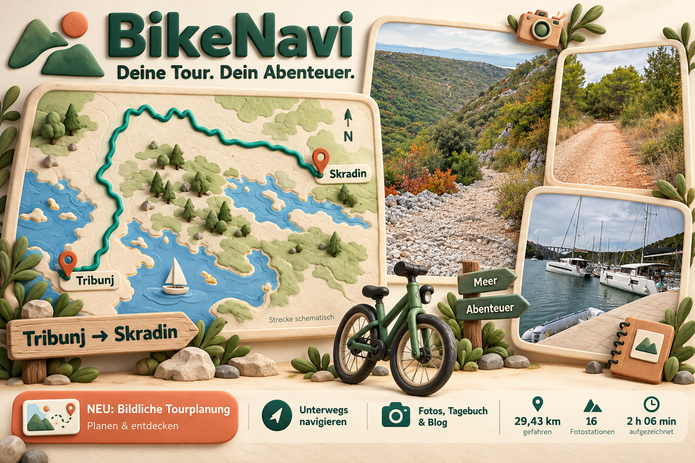
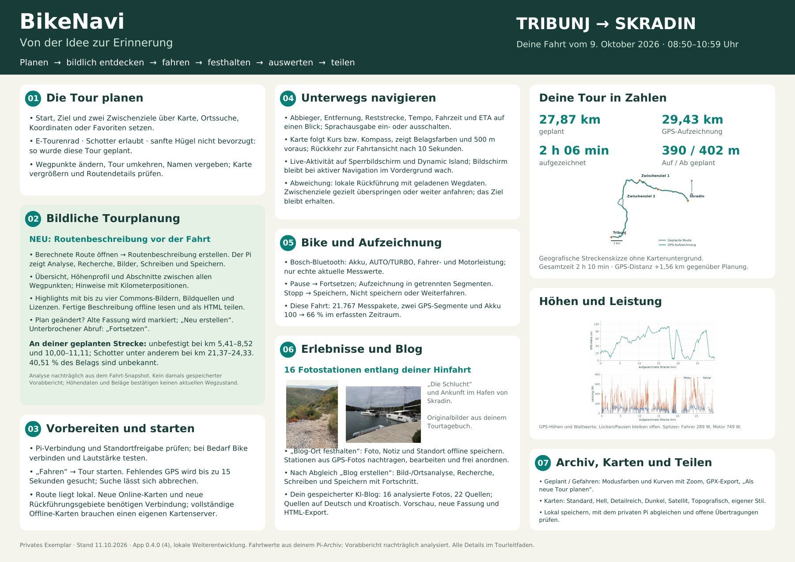
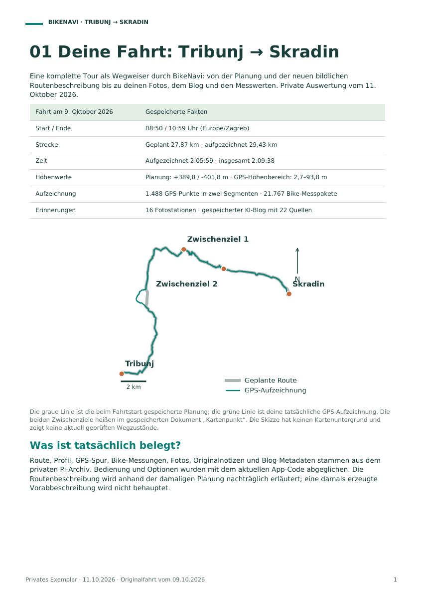

# BikeNavi entdecken

**Deine Tour. Dein Abenteuer.**

Vom ersten Ziel auf der Karte bis zum Reiseblog: BikeNavi begleitet Fahrradtouren auf dem iPhone. Die Fahrt **Tribunj → Skradin** vom **9. Oktober 2026** macht die Funktionen greifbar: **29,43 km aufgezeichnete Strecke**, **16 Fotostationen** und **2 h 06 min aufgezeichnete Zeit**.

## Drei Perspektiven auf deine nächste Tour

| Dokument | Was dich erwartet | Öffnen |
| --- | --- | --- |
| **Clay-Werbetafel** | Große Tourbilder, eine plastische Streckendarstellung und die wichtigsten Funktionen auf einen Blick. | **[A2-PDF ansehen](BikeNavi-Werbetafel-Clay-Tribunj-Skradin-A2.pdf)** · [PNG herunterladen](werbetafel-clay.png) |
| **Schautafel** | Planung, bildliche Routenbeschreibung, Fahrt, Bike-Daten, Fotos, Blog und Auswertung auf einer Seite. | **[A2-PDF ansehen](BikeNavi-Schautafel-Tribunj-Skradin-A2.pdf)** |
| **Tourleitfaden** | Acht Seiten mit den konkreten Schritten, Optionen und Auswertungen einer vollständigen Tour. | **[A4-PDF lesen](BikeNavi-Tourleitfaden-Tribunj-Skradin-A4.pdf)** |

## Vorfreude, Orientierung und Erinnerungen

- **Die Tour passend planen:** Start, Ziel und Zwischenziele auswählen, Favoriten nutzen, Fahrrad- und Belagswünsche festlegen und die Strecke prüfen.
- **Die Tour vorher entdecken:** Die neue bildliche Routenbeschreibung erläutert Abschnitte, Untergründe, steile Modellstellen und recherchierte Highlights mit Bildern.
- **Unterwegs den Überblick behalten:** Abbiegehinweise, Reststrecke, ETA, Sprachausgabe, Live-Aktivität und lokale Rückführung mit vorhandenen Wegdaten.
- **Das Bike einbeziehen:** Bosch-Bluetooth-Daten wie Akku, Fahrmodus sowie empfangene Fahrer- und Motorleistung anzeigen und zur Fahrt speichern.
- **Erlebnisse festhalten:** Fotos und Notizen mit Standort sammeln, Stationen ergänzen und anordnen, einen Reiseblog erstellen und als HTML teilen.
- **Die Fahrt auswerten:** Tatsächlich gefahrene Strecke, GPS-Höhen und Leistungswerte betrachten; eine Tour erneut planen oder als GPX exportieren.

## Ein kompletter Tourablauf auf einer Seite

**[Schautafel als PDF öffnen →](BikeNavi-Schautafel-Tribunj-Skradin-A2.pdf)**

## Schritt für Schritt mitfahren

Der Leitfaden behandelt die Ziele und Fahrprofile, die bildliche Tourplanung, den Fahrtstart, Navigation und Bike-Verbindung, Pausen, Fotostationen und Blog, Diagramme sowie Archiv, Karten und Offline-Nutzung.

**[Den achtseitigen Tourleitfaden lesen →](BikeNavi-Tourleitfaden-Tribunj-Skradin-A4.pdf)**

## Stand und Herkunft

Die drei Dokumente und die enthaltenen Tourdarstellungen wurden vom Projektinhaber ausdrücklich für diese GitHub-Präsentation freigegeben. Es handelt sich um ein echtes Praxisbeispiel; die Schautafel und der Leitfaden erläutern gespeicherte Fahrtwerte. Die Clay-Werbetafel wurde mit KI auf Basis der Tourfotos und Streckenreferenz gestaltet. Ihre plastische Karte ist eine schematische Werbeillustration.

Die bildliche Tourplanung beschreibt den neuen Entwicklungsstand vom **11. Oktober 2026**. Die Routenanalyse im Leitfaden wurde anhand der damaligen Planung nachträglich durchgeführt. App-Version **0.4.0**, Build **4**, bleibt der veröffentlichte Versionsstand; die Dokumente erklären auch spätere Weiterentwicklungen. Zeit- und Streckenwerte beziehen sich auf die angegebenen Aufzeichnungen; Modellhöhen und Kartendaten bestätigen keine aktuellen Wegzustände.

**[Zur App und zur Einrichtung →](../../README.md#starten)** · [Alle App-Bildschirme](../BILDSCHIRME.md) · [Entwicklungsstand](../UMSETZUNG.md) · [Änderungen](../../CHANGELOG.md)
